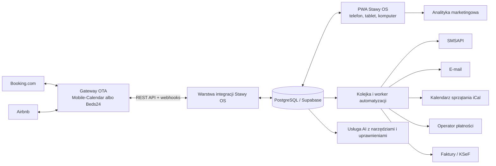

# Stawy OS — plan restrukturyzacji aplikacji

**Status:** decyzja produktowa i architektoniczna  
**Data audytu:** 13 lipca 2026  
**Zakres:** rezerwacje, kalendarze, sprzątanie, komunikacja, finanse, marketing, automatyzacje i wsparcie AI  
**Poza zakresem pierwszych etapów:** osobny panel dziadka

## 1. Decyzja w skrócie

Budujemy **Stawy OS** jako instalowalną aplikację webową działającą na telefonie, tablecie i komputerze. Ma być jednym ekranem do prowadzenia całej operacji Stawy u Sikory, ale w pierwszym etapie **nie budujemy samodzielnie channel managera łączącego się bezpośrednio z Booking.com i Airbnb**.

Najbezpieczniejsza i najtańsza ścieżka jest hybrydowa:

1. Certyfikowany dostawca pozostaje mostem do portali OTA.
2. Stawy OS pobiera z niego rezerwacje przez REST API i webhooks, wzbogaca je o operacje, marketing, sprzątanie i AI.
3. Rezerwacje lub blokady tworzone w Stawy OS są najpierw potwierdzane przez API dostawcy, a dopiero potem uznawane lokalnie za aktywne.
4. Warstwa integracji ma wspólny interfejs, więc dostawcę można później wymienić bez przepisywania całej aplikacji.

**Wstępny wybór dostawcy nie jest jeszcze zamknięty.** Mobile-Calendar daje pełne API Booking.com, ale jego publiczna oferta łączy Airbnb przez iCal. To wystarcza do podstawowego blokowania terminów, ale nie do pełnego pobierania danych gościa, ceny i płatności. Jeżeli bogate dane i dwukierunkowa obsługa Airbnb są wymagane od początku, mocniejszym kandydatem na warstwę OTA jest Beds24: oficjalny partner Airbnb Preferred+, deklarowany Booking.com Premier Partner, z API V2 i webhookami. Faza 0 ma wykonać krótki test obu rozwiązań i wybrać jedno na podstawie prawdziwych danych Stawów u Sikory.

To nie jest kapitulacja przed abonamentem. To świadome kupienie najtrudniejszej, regulowanej warstwy łączności, podczas gdy własne oprogramowanie przejmuje wszystkie elementy, które dają przewagę Stawom u Sikory.

### Dlaczego nie bezpośrednie API OTA

- Booking.com podaje, że pojedyncze obiekty nie są obecnie przyjmowane do bezpośrednich Connectivity APIs i powinny łączyć się przez channel managera. Nowe integracje dostawców są obecnie wstrzymane: [Booking.com Connectivity](https://connect.booking.com/).
- Airbnb udostępnia API w ramach programów integracyjnych. Dostawca przechodzi m.in. umowy, przegląd bezpieczeństwa i wymagania programu: [Airbnb API Terms](https://www.airbnb.com/help/article/3418), [Airbnb Software Partners](https://www.airbnb.com/software-partners).
- iCal może blokować terminy, ale przekazuje tylko podstawowe dane i odświeża się z opóźnieniem. Mobile-Calendar deklaruje import co 10–20 minut i eksport zależny od OTA zwykle co 10–60 minut, z jawnym ryzykiem overbookingu: [import iCal](https://docs.mobile-calendar.com/en/guides/integrations/icalendar-faq/icalendar-faq-how-fast-are-reservations-imported), [eksport iCal](https://docs.mobile-calendar.com/en/guides/integrations/icalendar-faq/icalendar-faq-how-fast-are-reservations-exported), [zakres danych iCal](https://docs.mobile-calendar.com/en/guides/integrations/icalendar-faq/icalendar-faq-what-data-is-synchronized).

### Koszt mostu integracyjnego

Publiczny cennik Mobile-Calendar dla 1–3 pokoi/domków, przy rozliczeniu rocznym i bez VAT, wynosi obecnie:

- Standard: 48 zł/miesiąc,
- Professional z channel managerem: 84 zł/miesiąc,
- Premium z REST API i webhookami: 100 zł/miesiąc.

Przy płatności miesięcznej ceny pokazane publicznie to odpowiednio 60, 105 i 125 zł. Źródło: [cennik Mobile-Calendar](https://www.mobile-calendar.com/en/pricing). Trzeba porównać to z faktyczną fakturą i planem taty, ale różnica pomiędzy publiczną ceną Standard i Premium to 52 zł miesięcznie przy płatności rocznej. Utrzymywanie własnych certyfikowanych integracji OTA kosztowałoby wielokrotnie więcej.

Alternatywa do testu, Beds24, publikuje cenę od 15,50 EUR miesięcznie oraz opłatę od 0,55 EUR za połączenie kanału. Dokładna cena zależy od konfiguracji dwóch domków i liczby połączeń: [cennik Beds24](https://www.beds24.com/pricing.html). Airbnb wymienia Beds24 jako partnera Preferred+, a sam dostawca udostępnia API do rezerwacji, danych osobowych i finansowych, inventory, wiadomości i webhooków: [Airbnb Software Partners](https://www.airbnb.com/software-partners), [Beds24 API V2](https://wiki.beds24.com/index.php/API_V2.0), [Beds24 Developer API](https://www.beds24.com/developer-api.html).

## 2. Co naprawdę oferuje Mobile-Calendar

Poniższy audyt opiera się na publicznej dokumentacji wersji webowej i mobilnej. Nie obejmuje konfiguracji prywatnego konta taty.

### 2.1 Rezerwacje i kalendarz

- widok wszystkich obiektów oraz widoki wybranego obiektu: miesięczny i roczny,
- przesuwanie rezerwacji metodą drag and drop,
- szybki podgląd rezerwacji,
- źródło rezerwacji i ikona kanału,
- własne kolory statusów,
- dodawanie, edycja, usuwanie i przywracanie rezerwacji,
- rezerwacje grupowe,
- blokady właścicielskie/techniczne,
- filtrowanie, drukowanie i wyszukiwanie dostępnych terminów,
- lista rezerwacji, historia, import i eksport danych.

Formularz rezerwacji ma cztery logiczne obszary:

- **pobyt:** obiekt, przyjazd, wyjazd, godziny, dorośli, dzieci,
- **gość:** imię, nazwisko, telefon, e-mail, dodatkowe dane, status stały/niepożądany klient,
- **szczegóły:** check-in/check-out, źródło, notatki, kod do drzwi,
- **finanse:** plan cenowy, cena za noc, liczba nocy, kwota pobytu, posiłki, dodatki, rabat, waluta, metoda i status płatności.

Źródło: [dodawanie rezerwacji](https://docs.mobile-calendar.com/en/guides/reservations/calendar/adding-reservation), [kalendarz](https://docs.mobile-calendar.com/en/guides/reservations/calendar).

### 2.2 Dashboard i sprzątanie

- dzisiejsze przyjazdy i wyjazdy,
- goście aktualnie na obiekcie,
- zaliczki z terminem płatności,
- szybkie zmiany check-in, check-out i statusu płatności,
- tygodniowe obłożenie, wolne i zajęte pokoje, dorośli i dzieci,
- osobna zakładka sprzątania,
- status obiektu: czysty, brudny, w trakcie sprzątania,
- zadania i notatki sprzątania,
- licznik zadań do wykonania.

Źródło: [dashboard i sprzątanie](https://docs.mobile-calendar.com/en/guides/reservations/dashboard/dashboard-basic-information).

### 2.3 Obiekty, klienci i pracownicy

- zarządzanie pokojami/domkami i typami obiektów,
- baza klientów z eksportem,
- nieograniczone konta pracowników,
- indywidualne loginy i zakresy uprawnień,
- historia aktywności i urządzeń pracownika.

Źródło: [zarządzanie](https://docs.mobile-calendar.com/en/guides/management), [pracownicy](https://docs.mobile-calendar.com/en/guides/management/employees).

### 2.4 Ceny, dostępność i dodatki

- kalendarz cen i dostępności,
- dowolna liczba planów cenowych,
- plany sezonowe, bezzwrotne, z wyżywieniem i dla długich pobytów,
- plany pochodne tańsze/droższe o procent lub kwotę,
- polityki zwrotów,
- ceny dla dzieci,
- różne waluty,
- usługi dodatkowe i posiłki,
- ceny i ograniczenia wysyłane do Booking.com w integracji API.

Źródło: [cenniki](https://docs.mobile-calendar.com/en/guides/pricing), [plany cenowe](https://docs.mobile-calendar.com/en/guides/pricing/price-calendar/adding-rate-plans).

### 2.5 Komunikacja i automatyzacje

- skrzynka e-mail i szablony,
- ręczne wysyłanie wiadomości,
- bramka SMS oparta na SMSAPI,
- automatyczne wiadomości e-mail lub SMS po zdarzeniu albo względem dat pobytu,
- filtry po domku, statusie płatności, źródle i języku,
- dodatkowe warunki, np. liczba nocy,
- odbiorca: gość i/lub własny numer/adres,
- powiadomienia w aplikacji, push i e-mail.

Dostępne wyzwalacze obejmują m.in. dodanie/anulowanie rezerwacji, czas przed lub po przyjeździe, czas przed lub po wyjeździe i przekroczony termin zaliczki. Źródła: [automatyczne wiadomości](https://docs.mobile-calendar.com/en/guides/communication/automatic-messages/configuration-automatic-messages), [SMSAPI](https://docs.mobile-calendar.com/en/guides/communication/sms/sms-gateway-configuration), [powiadomienia](https://docs.mobile-calendar.com/en/guides/notifications).

### 2.6 Statystyki i raporty

- przychód prognozowany i bieżący,
- obłożenie,
- podział przychodu na noclegi, wyżywienie i dodatki,
- metody płatności,
- źródła rezerwacji,
- liczba rezerwacji i anulacji,
- liczba dorosłych i dzieci oraz narodowość,
- średnia wartość rezerwacji i zaliczki,
- średnia długość pobytu,
- RevPAR,
- wyniki według domku,
- porównanie okresów i eksport CSV,
- raport przyjazdów/wyjazdów, opłaty miejscowej i posiłków.

Źródło: [statystyki](https://docs.mobile-calendar.com/en/guides/statistics-and-reports/finances-and-occupancy/generating-statistics).

### 2.7 Faktury i KSeF

- tworzenie, edycja, usuwanie, wyszukiwanie i filtrowanie dokumentów,
- masowy druk,
- generowanie JPK,
- konfiguracja KSeF i wysyłka faktur do KSeF.

Źródło: [faktury](https://docs.mobile-calendar.com/en/guides/invoices). Własnego silnika podatkowego nie powinniśmy budować. W 2026 obowiązki KSeF są wdrażane etapami, dlatego konfigurację trzeba potwierdzić z księgową i aktualnymi zasadami Ministerstwa Finansów: [KSeF — gov.pl](https://www.gov.pl/web/priorytety/p35).

### 2.8 Rezerwacje bezpośrednie i płatności online

- opis, zdjęcia i wyposażenie domków,
- wielojęzyczne treści,
- dodatki, finanse, regulamin i polityki,
- formularz, przycisk lub link osadzany na stronie,
- plugin WordPress i wsparcie Elementora,
- bramki PayU, Przelewy24, PayPal i Stripe,
- integracje Google Tag Manager, Meta/Facebook Pixel i Hotjar,
- zdarzenia lejka: wyszukiwanie, dodatki, płatność, potwierdzenie, dodanie/usunięcie z koszyka, zakup.

Źródło: [system rezerwacji online](https://docs.mobile-calendar.com/en/guides/online-reservation-system), [osadzanie na stronie](https://docs.mobile-calendar.com/en/guides/online-reservation-system/online-booking-system-configuration/online-booking-system-configuration-embedding-on-the-website), [analityka marketingowa](https://docs.mobile-calendar.com/en/guides/online-reservation-system/online-booking-system-configuration/online-reservation-system-analytics-and-marketing).

### 2.9 Integracje i API

- dwukierunkowa integracja Booking.com: rezerwacje i klienci do systemu, dostępność, ceny i ograniczenia do Booking.com,
- Airbnb oraz pozostałe publicznie wymienione portale są w Mobile-Calendar połączone przez iCal, nie pełne API,
- REST API z danymi rezerwacji, gości, pokoi, dostępności, cen, faktur i płatności,
- podpisane webhooks dla zdarzeń takich jak utworzenie, zmiana i anulowanie rezerwacji,
- retry webhooków i panel logów integracji.

API ma limit 60 żądań na minutę na użytkownika. Webhook dostarcza minimalny payload, który należy zweryfikować podpisem i następnie pobrać pełny rekord. Zwykle dociera w kilka sekund, ale dokumentacja dopuszcza opóźnienie do 2 minut. Źródła: [synchronizacja Booking.com](https://docs.mobile-calendar.com/en/guides/integrations/booking-com/booking-com-how-synchronization-works), [channel manager i lista typów połączeń](https://www.mobile-calendar.com/en/channel-manager), [REST API](https://www.mobile-calendar.com/en/rest-api), [dokumentacja API](https://mobile-calendar.gitbook.io/v1), [webhooks](https://mobile-calendar.gitbook.io/v1/webhooks/introduction).

Wniosek: Premium API Mobile-Calendar może być dobrym adapterem do jego własnego rekordu rezerwacji, lecz nie wzbogaci rezerwacji Airbnb o dane, których wcześniej nie dostarczył iCal. Dlatego pełny zakres Airbnb musi zostać potwierdzony podczas testu alternatywnego gatewaya.

### 2.10 Online check-in i wielourządzeniowość

- konfigurowalne pola i pola wymagane,
- QR do formularza check-in,
- akceptacja regulaminu online,
- karta meldunkowa PDF,
- obsługa rezerwacji z Booking.com i Airbnb,
- aplikacje iOS/Android,
- w trybie offline podgląd kalendarza i istniejących rezerwacji bez możliwości dodawania nowych.

Źródło: [online check-in](https://docs.mobile-calendar.com/en/guides/reservations/online-checkin), [tryb offline](https://docs.mobile-calendar.com/en/guides/introduction/getting-started-faq/does-the-application-work-offline).

## 3. Co kopiujemy, czego nie kopiujemy

Nie kopiujemy interfejsu ani kodu Mobile-Calendar. Kopiujemy sprawdzone **zdolności biznesowe** i układ procesu.

| Zdolność | Decyzja dla Stawy OS | Etap |
|---|---|---|
| Jeden kalendarz rezerwacji i blokad | budujemy własny, zasilany synchronizacją | rdzeń |
| Dane rezerwacji i gościa | budujemy rozszerzony rekord | rdzeń |
| Channel manager Booking/Airbnb | kupujemy jako warstwę integracyjną; dostawcę wybiera spike | rdzeń |
| Inbox błędów synchronizacji | budujemy lepszy, z retry i uzgodnieniem danych | rdzeń |
| Dashboard dnia | budujemy pod Stawy u Sikory | rdzeń |
| Sprzątanie | budujemy osobny prosty panel i kalendarz | rdzeń |
| SMS do sprzątającej | budujemy automatyzację przez SMSAPI | rdzeń |
| Zadania, checklisty i usterki | budujemy | rdzeń |
| Role i uprawnienia | budujemy dokładniejsze niż obecne | rdzeń |
| Baza gości i historia pobytów | budujemy | rdzeń |
| Zgody, motywacje i dane marketingowe | budujemy od pierwszego dnia | rdzeń |
| Prośby o opinie i pomiar efektów | budujemy od pierwszego dnia | rdzeń |
| Raporty obłożenia i przychodu | budujemy na własnych danych | etap 2 |
| Komunikacja z gościem | najpierw korzystamy z kanału Mobile-Calendar; potem własne centrum | etap 2 |
| Rezerwacje bezpośrednie | najpierw osadzamy gotowy silnik 0% prowizji; później własny checkout | etap 2/3 |
| Płatności online | integrujemy operatora, nie przechowujemy kart | etap 2/3 |
| Faktury/KSeF | integrujemy gotowy system, nie budujemy księgowości | etap 2/3 |
| Online check-in | wykorzystujemy gotowy, własny dopiero jeśli ma przewagę | etap 3 |
| Sugestie cenowe AI | budujemy po zebraniu wiarygodnych danych | etap 3 |
| Agent wykonujący działania | stopniowo, z progami i zatwierdzeniem | etap 4 |
| Natywne aplikacje iOS/Android | nie na początku; PWA wystarczy | później |
| Panel dziadka | odkładamy | poza MVP |

## 4. Docelowy produkt

### 4.1 Nawigacja

1. **Dzisiaj** — przyjazdy, wyjazdy, pobyty, sprzątanie, zaliczki, awarie synchronizacji i najważniejsze decyzje.
2. **Kalendarz** — oś czasu obu domków, rezerwacje, blokady, status źródła i konflikty.
3. **Rezerwacje** — lista i szczegóły pobytu.
4. **Operacje** — sprzątanie, checklisty, usterki i zadania.
5. **Goście i CRM** — historia, segmenty, zgody, opinie i komunikacja.
6. **Finanse** — płatności, prowizje, wypłaty, faktury, koszty i marża.
7. **Marketing** — źródła, kampanie, lejek direct, treści i zgody.
8. **Automatyzacje** — reguły, historia wykonań i błędy.
9. **Asystent AI** — rekomendacje i działania w kontekście aktualnego widoku.
10. **Integracje i ustawienia** — OTA, SMS, e-mail, płatności, faktury, analityka i użytkownicy.

### 4.2 Rekord rezerwacji

Jedna rezerwacja ma zakładki:

- **Pobyt:** domek, daty, osoby, status, źródło, zewnętrzny numer i historia zmian,
- **Gość:** kontakt, preferencje, dzieci, specjalne potrzeby i historia pobytów,
- **Finanse:** cena, prowizja, payout, płatności, zwroty, faktura i marża,
- **Komunikacja:** e-mail/SMS, szablony, wiadomości zaplanowane i wysłane,
- **Operacje:** sprzątanie, check-in/out, kod, checklisty, usterki,
- **Marketing:** źródło odkrycia, UTM, kampania, motywacja, obiekcje, zgody, NPS i opinia,
- **Historia:** każda zmiana człowieka, automatu, AI i integracji.

### 4.3 Panel sprzątającej

Panel ma być celowo bardzo prosty:

- dzisiaj i najbliższe 7 dni,
- domek, termin wyjazdu i termin następnego przyjazdu,
- status: do zrobienia, w trakcie, gotowe, problem,
- krótka checklista per domek,
- zgłoszenie usterki ze zdjęciem,
- przycisk „gotowe”,
- prywatny link do kalendarza Google/Apple przez subskrypcję iCal,
- SMS po nowej/zmienionej rezerwacji oraz przypomnienie przed sprzątaniem.

Sprzątająca nie widzi ceny, prowizji, pełnej historii gościa, danych marketingowych ani faktur. Telefon i e-mail gościa są ukryte, chyba że powstanie konkretny zatwierdzony proces wymagający kontaktu.

## 5. Architektura

### 5.1 Technologia

- **Frontend:** obecny Next.js i TypeScript, przebudowany jako responsywna PWA.
- **Baza i auth:** Supabase/PostgreSQL, Auth, Storage, Row Level Security.
- **Integracje:** osobny moduł adapterów; pierwszy adapter wybieramy po porównaniu `mobile_calendar` i `beds24`.
- **Zdarzenia:** podpisane webhooki przyjmowane szybko, odkładane do kolejki i przetwarzane asynchronicznie.
- **Automatyzacje:** worker z retry, idempotency key, dead-letter queue i panelem błędów.
- **Pliki:** prywatny storage dla zdjęć usterek, dokumentów i zgód.
- **Hosting:** zarządzane usługi w regionie UE, automatyczne backupy i monitoring.

### 5.2 Dwa źródła prawdy bez „split brain”

W okresie hybrydowym obowiązuje jasny podział:

- **Wybrany gateway OTA:** źródło prawdy dla dostępności sprzedawanej do OTA, cen i ograniczeń OTA oraz zewnętrznego statusu rezerwacji.
- **Stawy OS:** źródło prawdy dla operacji, sprzątania, marketingu, zgód, komunikacji wewnętrznej, analityki i rekomendacji AI.

Polecenie utworzenia rezerwacji lub blokady działa jako write-through:

1. Stawy OS zapisuje komendę jako oczekującą.
2. Wysyła ją do wybranego gatewaya OTA z kluczem idempotencji.
3. Po odpowiedzi lub webhooku potwierdza lokalną rezerwację.
4. Przy błędzie pokazuje stan „niezsynchronizowane” i nie udaje, że termin jest bezpiecznie zablokowany.

Raz dziennie proces uzgodnienia porównuje rezerwacje, anulacje, blokady, ceny i wypłaty. Rozbieżności trafiają do inboxu integracji.

### 5.3 Docelowy model danych

Najważniejsze tabele/domeny:

- `organizations`, `properties`, `units`,
- `reservations`, `reservation_channel_refs`, `availability_blocks`,
- `guests`, `guest_contacts`, `guest_preferences`, `consents`,
- `rate_plans`, `rate_overrides`, `availability_rules`,
- `payments`, `payouts`, `refunds`, `invoices`, `costs`,
- `tasks`, `turnovers`, `cleaning_checklists`, `issues`,
- `messages`, `message_templates`, `scheduled_messages`,
- `review_requests`, `reviews`,
- `marketing_touchpoints`, `campaigns`, `conversion_events`, `media_assets`,
- `automation_rules`, `automation_runs`,
- `integration_connections`, `external_records`, `sync_events`, `outbox_jobs`,
- `audit_log`, `ai_recommendations`, `ai_actions`.

Każdy zewnętrzny rekord ma parę `(provider, external_id)` z unikalnością. Każdy webhook ma unikalny delivery ID. Daty pobytu są traktowane jako przedział `[check-in, check-out)`, dzięki czemu wyjazd jednego gościa i przyjazd kolejnego tego samego dnia nie są konfliktem.

W bazie powstaje twarde zabezpieczenie przed nakładającymi się aktywnymi rezerwacjami tego samego domku. Konflikt integracyjny nie może zostać tylko czerwoną etykietą w interfejsie.

### 5.4 Role

- właściciel/admin,
- manager operacyjny,
- sprzątanie,
- marketing,
- księgowość,
- tylko podgląd.

Uprawnienia działają na poziomie bazy, nie tylko przez ukrywanie przycisków.

## 6. Marketing wymagany od pierwszego dnia

Marketing nie powinien czekać na „wersję po operacjach”, bo danych historycznych nie da się później odzyskać.

Od pierwszej produkcyjnej rezerwacji zapisujemy:

- kanał rezerwacji oraz osobno kanał pierwszego odkrycia,
- `utm_source`, `utm_medium`, `utm_campaign`, `utm_content`, `utm_term`,
- identyfikator kampanii/reklamy, landing page i referrer,
- datę pierwszego i ostatniego kontaktu,
- lead time i długość pobytu,
- segment, motywację, obiekcje i istotne słowa gościa,
- zgodę marketingową z treścią, źródłem, datą i wycofaniem,
- prośbę o opinię, kliknięcie linku i pozyskaną opinię,
- NPS/satysfakcję,
- zgodę i zakres wykorzystania zdjęć/contentu.

Dla rezerwacji bezpośrednich śledzimy lejek: wejście → wyszukanie terminu → wybór domku → dodatki → rozpoczęcie płatności → rezerwacja → zapłata. Do systemów reklamowych nie wysyłamy niepotrzebnych danych osobowych.

Najważniejsze KPI:

- udział rezerwacji direct,
- koszt pozyskania i przychód według kanału,
- konwersja lejka direct,
- obłożenie, ADR, RevPAR i marża,
- lead time i średnia długość pobytu,
- prowizja OTA zaoszczędzona przez direct,
- liczba i średnia ocen opinii,
- odsetek pobytów z uzupełnionym źródłem odkrycia i zgodami.

## 7. Automatyzacje

Automatyzacja składa się z: **zdarzenia, warunków, opóźnienia, akcji, odbiorcy, retry i historii wykonania**.

### Reguły pierwszego wydania

1. Nowa rezerwacja → import → sprawdzenie konfliktu → utworzenie zadań → zaplanowanie sprzątania.
2. Zmiana dat → aktualizacja sprzątania i powiadomienie sprzątającej.
3. Anulowanie → anulowanie zadań i wiadomość do odpowiednich osób.
4. Wyjazd → domek „brudny” → zadanie sprzątania.
5. Sprzątanie 24h przed terminem → SMS z prywatnym linkiem.
6. Problem zgłoszony przez sprzątającą → zadanie wysokiego priorytetu dla właściciela.
7. Termin zaliczki minął → przypomnienie i alert właściciela.
8. Dzień przed przyjazdem → instrukcja dla gościa, jeśli kanał komunikacji na to pozwala.
9. Dzień po wyjeździe → prośba o opinię z indywidualnym linkiem.
10. Nowa opinia → zapis, powiadomienie i propozycja odpowiedzi.
11. Niskie obłożenie w określonym oknie → rekomendacja ceny/promocji, bez automatycznej publikacji.
12. Błąd synchronizacji → retry, a po limicie alert i zadanie ręczne.

Każda wiadomość ma podgląd, status, czas, odbiorcę i przyczynę wysyłki. Musi istnieć tryb testowy i globalny wyłącznik automatyzacji.

## 8. AI i działanie agentowe

AI nie zaczyna od samodzielnej zmiany cen. Zaczyna od uporządkowania danych i rekomendacji z dowodami.

### Etap A — copilot tylko do odczytu

- dzienny brief operacyjny,
- wykrywanie braków i anomalii,
- podsumowanie komunikacji z gościem,
- propozycje odpowiedzi i wiadomości,
- podsumowanie opinii i powtarzających się problemów,
- propozycje segmentów i kampanii.

### Etap B — działania po zatwierdzeniu

- utworzenie zadania,
- zaplanowanie SMS/e-mail,
- przygotowanie odpowiedzi na opinię,
- przygotowanie zmiany ceny lub promocji,
- przygotowanie kampanii do byłych gości ze zgodą.

Użytkownik widzi dokładny podgląd skutku i zatwierdza działanie.

### Etap C — ograniczona autonomia

Automatyczne wykonanie tylko niskiego ryzyka i w jawnych limitach. Zmiana ceny, anulowanie, zwrot, faktura, publikacja marketingowa i wiadomość do większej grupy wymagają zatwierdzenia co najmniej do czasu udowodnienia jakości procesu.

### Dane do sensownych sugestii cenowych

- historia obłożenia i cen,
- lead time,
- dzień tygodnia, sezon i długość pobytu,
- anulacje,
- minimalna akceptowalna marża,
- koszty sprzątania i prowizje,
- wydarzenia lokalne i święta,
- pogoda,
- opcjonalnie legalne źródło stawek porównawczych.

Każda rekomendacja pokazuje: proponowaną zmianę, powód, użyte dane, ich świeżość, przewidywany wpływ, pewność i termin ważności.

## 9. Finanse, płatności i faktury

### Płatności

- operator obsługuje kartę/BLIK/przelew; Stawy OS zapisuje tylko tokeny, statusy i identyfikatory,
- webhook operatora jest źródłem statusu transakcji,
- każda płatność, zwrot, prowizja i wypłata ma osobny wpis w ledgerze,
- system uzgadnia kwotę rezerwacji, wpłaty, prowizję OTA i payout.

### Faktury

Nie implementujemy własnych reguł podatkowych i KSeF. Integrujemy istniejący system, który obsługuje bieżący stan prawny. Stawy OS inicjuje dokument i przechowuje numer, status, kwoty, PDF/link oraz identyfikator KSeF. Ostateczny proces trzeba zatwierdzić z księgową.

## 10. Bezpieczeństwo i RODO

- hosting i backupy w UE,
- RLS i zasada najmniejszych uprawnień,
- sekrety integracji wyłącznie po stronie serwera,
- szyfrowanie transportu i danych wrażliwych,
- podpisy webhooków i ochrona przed replay,
- pełny audit log zmian i działań AI,
- ograniczenie danych sprzątającej,
- rejestr treści zgody, źródła, daty i wycofania,
- polityka retencji i usuwania/anonimizacji,
- eksport danych gościa,
- brak danych kart w naszej bazie,
- minimalizacja i redakcja PII przekazywanych do modelu AI,
- monitoring błędów bez logowania niepotrzebnych danych osobowych.

## 11. Ocena obecnego prototypu

### Co warto zachować

- Next.js, TypeScript i ogólny kierunek aplikacji webowej,
- marketingowe pola gościa,
- zgody i media,
- dashboard jakości danych,
- checks i wykrywanie konfliktów,
- zadania generowane wokół pobytu,
- tabela rezerwacji i eksport CSV,
- pomysł na inbox integracji.

### Co wymaga wymiany

- dane są tylko w `localStorage` jednej przeglądarki,
- logowanie jest atrapą,
- nie istnieje żaden działający importer/API/webhook,
- kalendarz jest listą kart, nie osią czasu,
- konflikt jest tylko wykrywany w kodzie, a nie blokowany w bazie,
- są tylko role `admin/viewer`,
- RLS obecnej migracji jest za szeroki dla docelowych ról,
- brak unikalnych zewnętrznych ID, idempotencji, kolejki, retry i uzgadniania danych,
- brak audit logu i historii automatyzacji,
- brak płatności, faktur, komunikacji, sprzątania i opinii jako pełnych domen,
- model TypeScript i SQL nie są w pełni spójne, np. właściciel zadania jest tekstem w aplikacji, a UUID w bazie,
- daty rezerwacji są nullable w bazie, mimo że proces operacyjny ich wymaga,
- brak testów krytycznych reguł, integracji i bezpieczeństwa.

Obecny kod powinien zostać potraktowany jako prototyp UX i katalog potrzeb, a nie baza produkcyjna do prostego „podpięcia Supabase”.

## 12. Roadmapa

Terminy są orientacyjne dla jednej osoby rozwijającej produkt z pomocą narzędzi AI i zaczynają się dopiero po uzyskaniu dostępów integracyjnych.

### Faza 0 — porównawczy spike integracyjny i kopia bezpieczeństwa (4–7 dni)

- sprawdzenie faktycznego planu i faktury Mobile-Calendar,
- włączenie trialu Premium/sandboxa Mobile-Calendar oraz trialu Beds24,
- odczyt rezerwacji, domków, gości, wiadomości i płatności z obu API,
- test utworzenia i anulowania blokady/rezerwacji,
- test podpisu webhooka, retry i opóźnienia,
- porównanie rzeczywistych pól Booking.com i Airbnb w obu rozwiązaniach,
- mapa obu domków między gatewayem, Booking.com i Airbnb,
- wyliczenie całkowitego miesięcznego kosztu obu wariantów,
- pełny eksport obecnych danych i plan rollbacku,
- profil jakości danych: duplikaty klientów, nieuzupełnione płatności, stare statusy i niespójne źródła,
- rozdzielenie obecnego pola „źródło” na kanał sprzedaży, źródło pozyskania i kampanię.

**Bramka decyzji:** nie zaczynamy większej przebudowy, dopóki nie potwierdzimy, który gateway zapewnia wymagany write-through, pełniejsze dane Airbnb, niezawodne webhooki i akceptowalny koszt.

### Faza 1 — produkcyjny rdzeń (2–4 tygodnie)

- nowy model bazy i migracje,
- Supabase Auth, role i RLS,
- API/webhook adapter wybranego gatewaya,
- kolejka, retry, idempotencja i uzgadnianie,
- prawdziwy kalendarz wielodomkowy,
- szczegóły rezerwacji,
- blokady i twarda ochrona przed konfliktem,
- dashboard dnia i zdrowie synchronizacji,
- centrum dowodzenia pojedynczej rezerwacji: gość, pobyt, płatności, komunikacja, zadania, historia i dane OTA w jednym miejscu,
- lista rezerwacji z marżą, prowizją, statusem synchronizacji, jakością danych i następną wymaganą akcją,
- audit log, monitoring i backup.

**Gotowe, gdy:** rezerwacja, zmiana i anulowanie z OTA pojawiają się bez ręcznego przepisywania, a rozbieżność nigdy nie znika bez śladu.

### Faza 2 — sprzątanie i automatyzacje (1–2 tygodnie)

- turnovers i checklisty,
- automatyczne zadanie po każdym wyjeździe,
- osobny panel mobilny sprzątającej,
- prywatny kalendarz iCal,
- SMSAPI, szablony, retry i historia,
- zgłoszenia usterek ze zdjęciem.

**Gotowe, gdy:** każda zmiana terminu aktualizuje sprzątanie, a sprzątająca może potwierdzić wykonanie z telefonu bez dostępu do danych finansowych.

### Faza 3 — CRM, opinie i marketing od danych (1–2 tygodnie)

- rozszerzony profil gościa i zgody,
- UTM oraz first/last touch,
- automatyczne prośby o opinię,
- zapis opinii i statusów,
- lejek rezerwacji direct,
- dashboard kanałów, segmentów i marży,
- przeniesienie wartościowych ekranów z obecnego prototypu.

### Faza 4 — płatności, finanse i direct booking (2–4 tygodnie)

- na początku osadzenie silnika direct wybranego gatewaya z pełnym trackingiem,
- ledger płatności, prowizji, payoutów i kosztów,
- uzgodnienie z operatorem płatności,
- integracja faktur/KSeF,
- marża na rezerwacji i domku,
- dopiero później decyzja, czy własny checkout ma realny zwrot.

### Faza 5 — AI (iteracyjnie po zebraniu danych)

- dzienny brief i wykrywanie anomalii,
- pomoc w komunikacji i opiniach,
- rekomendacje marketingowe,
- rekomendacje cenowe z uzasadnieniem,
- zatwierdzane działania,
- ograniczona autonomia po zebraniu historii skuteczności.

## 13. Kryteria sukcesu pierwszej wersji

- 100% rezerwacji z podłączonych źródeł trafia do jednego kalendarza bez ręcznego przepisywania,
- każda rezerwacja ma zewnętrzny identyfikator i ślad synchronizacji,
- brak możliwości lokalnego potwierdzenia nachodzących rezerwacji tego samego domku,
- każda zmiana i anulowanie tworzą aktualizację operacji,
- każde wymagane sprzątanie ma zadanie, właściciela, termin i status,
- sprzątająca dostaje SMS oraz ma kalendarz i panel mobilny,
- każdy błąd integracji ma retry, alert i widoczny stan,
- po każdej kwalifikującej się rezerwacji powstaje prośba o opinię,
- dane marketingowe direct są zbierane od pierwszego dnia,
- wszystkie zmiany cen i działania wysokiego ryzyka AI są zatwierdzane i audytowane,
- system działa responsywnie na telefonie, tablecie i komputerze.

## 14. Ryzyka i zabezpieczenia

| Ryzyko | Zabezpieczenie |
|---|---|
| Brak bezpośredniego dostępu do API OTA | certyfikowany channel manager jako adapter |
| Overbooking przez iCal | pełne API dla Booking; iCal tylko jako fallback ze statusem ryzyka |
| Rozjazd Stawy OS i gatewaya OTA | jedna polityka źródła prawdy, outbox, idempotencja, dzienne uzgodnienie |
| Awaria webhooków | kolejka, retry, okresowy polling i inbox błędów |
| Uzależnienie od dostawcy | własny model domenowy i interfejs adaptera, nie kopiowanie jego struktur do całej aplikacji |
| Wyciek danych gości | RLS, minimalne role, prywatne pliki, redakcja PII i audit log |
| Błędy podatkowe | integracja KSeF-ready i zatwierdzenie z księgowością |
| AI wykona złą akcję | podgląd, limity, zatwierdzenie, allowlista narzędzi, globalny kill switch |
| Brak danych do wyceny | AI tylko rekomenduje po osiągnięciu minimalnej jakości danych |
| Zbyt duży zakres | fazy z bramkami i kryteriami „gotowe, gdy” |

## 15. Dane i dostępy potrzebne do Fazy 0

Nie są potrzebne do podjęcia decyzji architektonicznej, ale będą potrzebne do wdrożenia:

- aktualny plan, faktura i liczba obiektów w Mobile-Calendar,
- dostęp właścicielski do Mobile-Calendar,
- możliwość trialu Premium/API lub dane sandbox,
- konto próbne Beds24 i wyliczenie konfiguracji dwóch domków,
- Hotel ID i konfiguracja połączenia Booking.com,
- lista ofert Airbnb i ich mapowanie do domków,
- obecne feedy iCal, jeśli istnieją,
- eksport wszystkich rezerwacji, klientów, płatności i faktur,
- obecne szablony wiadomości,
- numer/zasady komunikacji z panią sprzątającą,
- decyzja, czy używamy SMSAPI oraz kto jest właścicielem konta,
- proces faktur i kontakt do księgowej,
- istniejąca strona, GTM/GA4/Meta Pixel i domena,
- teksty zgód i regulaminów.

## 16. Pierwszy konkretny krok

Nie zaczynamy od przebudowy ekranów. Zaczynamy od **Fazy 0: porównawczego testu Mobile-Calendar Premium i Beds24 na kopii danych**. Wybieramy rozwiązanie, które potwierdzi dwukierunkową pracę rezerwacji, blokad, cen, statusów oraz wystarczająco bogate dane Airbnb. Dopiero wtedy budujemy produkcyjny rdzeń Stawy OS wokół stabilnego kontraktu integracyjnego.

Równocześnie zamrażamy obecny prototyp jako referencję marketingową. Nie rozwijamy dalej `localStorage` ani obecnej migracji SQL — nowy model powstaje jako wersja 2.

## 17. Audyt zalogowanego kokpitu Mobile-Calendar

Audyt wykonano 13 lipca 2026 r. na rzeczywistym koncie Stawów u Sikory w planie Standard, bez zmieniania danych. Konto zawiera dwa pomieszczenia, około 200 historycznych rekordów rezerwacji i klientów oraz własne szablony wiadomości. To wystarcza, aby ocenić nie tylko listę funkcji, ale też ich codzienną użyteczność.

### 17.1 Rzeczywista mapa aplikacji

| Obszar | Ekrany widoczne w aplikacji |
|---|---|
| Operacje | kalendarz, pulpit dnia, sprzątanie, lista rezerwacji, historia, online check-in |
| Zasoby | pokoje, typy pomieszczeń, pracownicy, baza klientów |
| Komunikacja | konto pocztowe, szablony, wiadomości, automatyczne wiadomości, bramka SMS |
| Przychód | ceny, plany cenowe, ceny dzieci, dodatki, wyżywienie, podatek lokalny |
| Analityka | statystyki, przyjazdy/wyjazdy, wyżywienie, podatek lokalny |
| Finanse | nowa faktura, lista faktur, KSeF, ustawienia faktur |
| Direct booking | ośmiostopniowa konfiguracja Booking Engine v2, rezerwacje, widgety |
| Integracje | Channel Manager, REST API, integracje zewnętrzne |

Zakres domenowy jest dojrzały. Nie powinniśmy kopiować struktury menu jeden do jednego, ponieważ prowadzi ona do wielu osobnych ekranów i przełączania kontekstu. Powinniśmy skopiować pokrycie procesów, a przebudować sposób pracy wokół dnia, rezerwacji i wyjątków wymagających działania.

### 17.2 Co warto zachować

- kalendarz jako główny widok pracy, z szybkim przejściem do dziś, miesiąca i roku,
- prosty przycisk dodania rezerwacji i raportu z pulpitu,
- pulpit z przyjazdami, wyjazdami, pobytami, zadatkami i obłożeniem,
- filtrację listy rezerwacji po terminach, domkach, płatnościach i źródłach,
- widoczne statusy płatności: brak wpłaty, zadatek oczekiwany, zadatek po terminie, zadatek opłacony i całość opłacona,
- bazę klientów powiązaną z historią rezerwacji,
- wielojęzyczne szablony wiadomości,
- cennik obejmujący restrykcje, dzieci, dodatki, wyżywienie i podatek lokalny,
- raporty operacyjne i statystyki per pomieszczenie,
- proces konfiguracji direct booking obejmujący treści, finanse, regulamin, aktywację, osadzenie oraz analitykę i marketing,
- faktury i KSeF jako naturalną część systemu rezerwacyjnego.

### 17.3 Ograniczenia widoczne na realnym koncie

1. **Automatyzacje są poza codziennym planem.** W Standard niedostępne są automatyczne wiadomości, bramka SMS i pracownicy. Channel Manager oraz REST API przekierowują do rozszerzenia subskrypcji. W praktyce podstawowy kalendarz działa, ale ręczne przepisywanie i ręczna koordynacja pozostają.

2. **Sprzątanie jest zbyt płytkie.** Pulpit ma osobną zakładkę „Sprzątanie”, a pokoje mają status „Czysty”, lecz brak kompletnego procesu: przypisanej osoby, terminu wynikającego z wyjazdu i następnego przyjazdu, checklisty, priorytetu, SMS-a, potwierdzenia, zdjęć, usterek i historii wykonania.

3. **Lista rezerwacji nie jest centrum operacji.** Dobrze pokazuje klienta, pokój, daty i płatność, ale brakuje na wierzchu liczby gości i nocy, kwoty i waluty, prowizji, wypłaty, marży, czytelnej nazwy kanału, statusu synchronizacji, jakości danych i następnej akcji.

4. **Taksonomia źródeł miesza różne pojęcia.** W jednym filtrze są OTA, telefon, e-mail, strona WWW, polecenie i reklama na Facebooku. To uniemożliwia poprawną atrybucję. W Stawy OS zapisujemy osobno `booking_channel`, `discovery_source`, `campaign_id` i surową wartość odziedziczoną z importu.

5. **Płatność jest statusem, nie uzgodnionym ledgerem.** Wiele pozycji ma „Brak wpłaty”, ale ekran nie pokazuje, czy informacja jest aktualna, z jakiego źródła pochodzi i kiedy była uzgodniona. Stawy OS potrzebuje osobnych płatności, zwrotów, prowizji i payoutów oraz widocznego czasu ostatniego uzgodnienia.

6. **Statystyki są opisowe, lecz słabo decyzyjne.** Są obłożenie, obrót, zadatki, długość pobytu i przekrój per domek, ale brakuje kosztów, prowizji, marży, ADR liczonego jednolicie, pickup, lead time, anulacji według kanału i rekomendowanej następnej decyzji. Nazwy części wskaźników wymagają też jednoznacznych definicji.

7. **Klienci są książką adresową, nie CRM-em marketingowym.** W bazie dominują dane kontaktowe. Brakuje widocznego źródła zgody, segmentów, wartości klienta, preferencji, historii opinii, kampanii i powodów rezygnacji.

8. **Menu odzwierciedla moduły, a nie pracę do wykonania.** Użytkownik przechodzi między rezerwacją, wiadomościami, sprzątaniem, płatnościami i fakturami. Dla dwóch domków nadal tworzy to zbędny ciężar poznawczy.

### 17.4 Korekty produktu po audycie

| Mobile-Calendar | Stawy OS |
|---|---|
| osobne pulpity operacji i sprzątania | jeden ekran „Dzisiaj” z przyjazdami, wyjazdami, turnoverami, płatnościami, wiadomościami i alarmami synchronizacji |
| kalendarz bez widocznego zdrowia integracji | kalendarz z kanałem, stanem synchronizacji, konfliktem i czasem ostatniego potwierdzenia |
| rezerwacja rozproszona między moduły | jeden workspace rezerwacji z osią czasu wszystkich zdarzeń |
| status pokoju „Czysty” | zadanie turnover z właścicielem, SLA, checklistą, dowodem i eskalacją |
| jedno pole źródła | kanał sprzedaży + źródło pozyskania + kampania + UTM |
| status wpłaty | ledger płatności, payoutów, prowizji, zwrotów i uzgodnień |
| raport historyczny | cockpit decyzyjny: co wymaga działania i dlaczego |
| funkcje automatyczne jako wyższy plan | silnik zdarzeń i automatyzacji jako część rdzenia |
| duża liczba pozycji menu | pięć głównych obszarów: Dzisiaj, Kalendarz, Rezerwacje, Goście/Marketing, Finanse; ustawienia i integracje osobno |

### 17.5 Minimalny zakres migracji z realnego konta

Przed przełączeniem trzeba wyeksportować i porównać liczby kontrolne dla pomieszczeń, rezerwacji, klientów, płatności, faktur i szablonów. Import zachowuje oryginalne identyfikatory Mobile-Calendar, surowe źródło i pełną historię zmian. Rekordów klientów nie łączymy automatycznie wyłącznie po imieniu; deduplikację wykonujemy po znormalizowanym telefonie/e-mailu z kolejką ręcznej akceptacji dla niejednoznacznych przypadków.

Najpierw uruchamiamy Stawy OS w trybie równoległym i tylko do odczytu. Dopiero po uzgodnieniu rezerwacji, blokad i płatności oraz kontrolowanym teście obu kanałów przełączamy zapis. Nie wyłączamy Mobile-Calendar, dopóki nowy system nie przejdzie pełnego cyklu: nowa rezerwacja, zmiana, anulowanie, płatność, wyjazd i sprzątanie.
