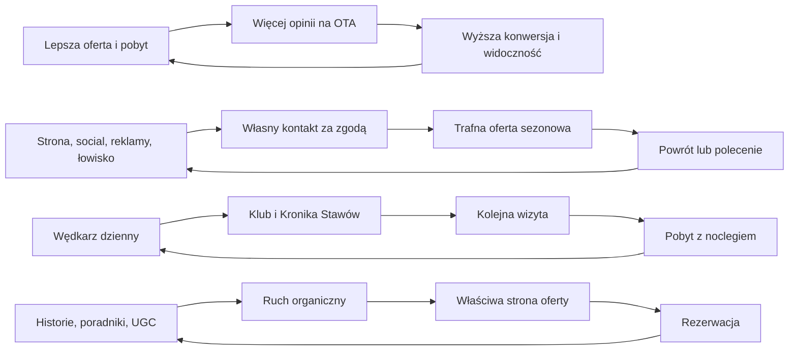

# Strategia wzrostu Stawów u Sikory — V1

**Wersja:** 1.1<br>
**Data:** 17 lipca 2026<br>
**Status:** dokument roboczy do walidacji danymi<br>
**Horyzont:** 0–24 miesiące<br>
**Zakres:** noclegi, łowisko, marka, segmentacja, marketing, sprzedaż, dystrybucja, retencja, operacje i rozwój oferty

**Zmiana 1.1:** dodano pełną architekturę marki, badanie gości, system Meta → Google → rezerwacja, proces sprzedaży, zasady atrybucji i rekomendowany model prowizji.

> Ten dokument jest warstwą biznesową nad planem produktu Stawy OS. Określa, **co ma rosnąć, w jakiej kolejności i po czym poznamy, że warto inwestować dalej**. Nie zastępuje porady prawnej ani księgowej.

---

## 1. Decyzja strategiczna w jednym zdaniu

**Najpierw maksymalizujemy całoroczną marżę z istniejących domów i łowiska, wykorzystując OTA jako kanał pozyskania, a równolegle budujemy własne aktywa — markę, stronę, pomiar, zgodową bazę kontaktów i proces gościnności — żeby później zwiększać udział rezerwacji bezpośrednich i dopiero wtedy dokładać saunę lub nowe jednostki.**

To oznacza następującą kolejność:

1. Naprawić pomiar i podstawy operacyjne.
2. Zwiększyć widoczność i konwersję obecnej oferty na Booking.com i Airbnb.
3. Stworzyć konkretne powody przyjazdu poza sezonem, a ceną tylko je wspierać.
4. Systemowo zbierać opinie, rekomendacje i własne kontakty — zgodnie z prawem i politykami platform.
5. Uruchomić profesjonalną rezerwację bezpośrednią z płatnością i synchronizacją kalendarzy.
6. Podnieść wartość pobytu małymi zmianami, a następnie przetestować saunę.
7. Rozbudowywać pojemność dopiero wtedy, gdy obecne zasoby i operacje są wystarczająco wykorzystane.

---

## 2. Co naprawdę optymalizujemy

### Cel nadrzędny

**Roczna marża kontrybucyjna z dostępnej nocy**, a nie sama liczba rezerwacji ani samo obłożenie.

Wysokie obłożenie osiągnięte przez zbyt duże rabaty może wyglądać jak wzrost, a jednocześnie pogarszać wynik. Każda decyzja cenowa, promocyjna i kanałowa ma odpowiadać na pytanie:

> Ile pieniędzy zostaje po koszcie kanału, rabatach, płatności, sprzątaniu, mediach, materiałach i obsłudze?

### Główne wskaźniki

| Obszar | Wskaźnik | Po co go mierzymy |
|---|---|---|
| Wynik | marża kontrybucyjna / dostępna noc | nadrzędna jakość wzrostu |
| Kalendarz | obłożenie osobno: wysoki sezon, okres przejściowy, niski sezon | pokazuje prawdziwą lukę wzrostu |
| Cena | ADR brutto i ADR netto | odróżnia cenę widoczną od realnego wpływu |
| Kanały | efektywny koszt pozyskania Booking/Airbnb/direct | weryfikuje założenie „Booking kosztuje 20%” |
| Retencja | udział pobytów powracających | pokazuje, czy powstaje lojalność |
| Dystrybucja | udział zrealizowanych rezerwacji direct | mierzy uniezależnianie się od OTA |
| Reputacja | odsetek pobytów zakończonych opinią i średnia ocen | wspiera widoczność oraz konwersję |
| Baza własna | udział uprawnionych kontaktów z ważną zgodą | mierzy przyszły zasięg własny |
| Polecenia | zrealizowane pobyty z polecenia i ich koszt | mierzy jakość programu rekomendacji |
| Operacje | reklamacje, czas reakcji, gotowość domu na czas | chroni opinię i powroty |

Stosujemy reguły z [SŁOWNIKA KPI](./SLOWNIK_KPI_V1.md): przy małych próbach nie udajemy pewności. Mniej niż 10 obserwacji nie wystarcza do rekomendacji, 10–29 daje jedynie kierunek, 30+ pozwala na ostrożną decyzję.

---

## 3. Diagnoza Stawów u Sikory

### Mocne strony już istnieją

- Miejsce ma prawdziwy, trudny do skopiowania zasób: sześć stawów, wodę, lasy, przestrzeń, ciszę i historię gospodarstwa.
- Produkt ma społeczne potwierdzenie. Publiczny obraz z lipca 2026 pokazywał dla Domu Rybak ocenę ok. 9,5 na Booking.com, lokalizację 9,9 i dla Czapli 4,85/5 na Airbnb.
- Lokalizacja jest najmocniejszą ocenianą cechą. Nie trzeba wymyślać sztucznej atrakcji marki — trzeba lepiej sprzedać to, co już istnieje.
- Łowisko dostarcza własny, lokalny ruch i naturalny segment powracający.
- Istnieje już przewodnik PL/EN/DE i materiał do opowieści: historia stawów, ryby, gospodarze, dziadek, okolica.
- Goście już czasem znajdują obiekt na OTA, a następnie odzywają się bezpośrednio. To dowód intencji, ale nie jest jeszcze systemem.

### Główne ograniczenia

- Nie ma jednego wiarygodnego obrazu popytu, marży, lead time, pustych slotów i kosztu kanałów.
- Strona nie sprzedaje pobytu. Obecna strona opisuje gospodarstwo, ale nie prowadzi klarownie od potrzeby gościa do dostępności i płatności. Zawiera też przestarzałe elementy, np. rozbudowane komunikaty covidowe.
- Marka łączy łowisko i noclegi, ale nie daje dwóm grupom prostych, osobnych ścieżek.
- Rezerwacja bezpośrednia jest ręcznym przelewem, więc nie da się jej bezpiecznie skalować reklamami.
- Retencja opiera się na pamięci i relacji gospodarzy, a nie na zgodach, segmentach i terminach kontaktu.
- Poza sezonem próbuje się sprzedawać głównie ten sam nocleg w gorszej pogodzie. Potrzebny jest inny produkt i inny powód przyjazdu.
- Operacja jest rodzinna i zależna od osób. Dołożenie ludzi bez SOP i jednego lidera tylko powiększy chaos.

### Co mówią publiczne oceny

W publicznym widoku Booking.com mocne były lokalizacja i komfort, a słabsze: stosunek jakości do ceny, czystość oraz Wi‑Fi. Liczby są jeszcze oparte na małej próbie, więc nie są wyrokiem, ale wskazują kolejność audytu:

1. niezawodność sprzątania i odbioru domu,
2. jakość oraz pomiar Wi‑Fi,
3. lepsze przedstawienie wartości w ofercie i zdjęciach,
4. dopiero potem podnoszenie ceny.

---

## 4. Model wzrostu: cztery pętle, nie jeden newsletter



### Pętla 1: reputacja OTA

Lepsza prezentacja i obsługa → więcej autentycznych opinii → lepsza konwersja i widoczność → więcej rezerwacji → więcej opinii.

### Pętla 2: własny popyt i powroty

Strona, social, reklamy, polecenia i ruch z łowiska → dobrowolny zapis lub rezerwacja direct → segmentacja → trafna wiadomość przed kolejnym sezonem → powrót.

### Pętla 3: łowisko do noclegu

Wędkarz dzienny → dobra pierwsza wizyta → klub/UGC → kolejna wizyta → oferta weekendu wędkarskiego → nocleg → polecenie innym wędkarzom.

### Pętla 4: treść do sprzedaży

Prawdziwe historie, zdjęcia, odpowiedzi na pytania i przewodniki → wyszukiwarka/social → właściwa strona oferty → rezerwacja → nowy materiał i dowód.

---

## 5. Kolejność strategiczna i bramki inwestycyjne

### Etap 0 — źródło prawdy i marża (0–30 dni)

#### Wynik etapu

Możemy powiedzieć, które noce i segmenty są naprawdę niewykorzystane oraz ile zarabia każdy kanał.

#### Obowiązkowe działania

- Import minimum 12–24 miesięcy rezerwacji do jednego kalendarza analitycznego.
- Dla każdego pobytu: dom, termin, liczba nocy, cena, kanał, rabaty, prowizja, anulacja, lead time, liczba gości, koszt sprzątania i źródło odkrycia, jeśli znane.
- Rozdzielenie dni zamkniętych przez właściciela od dni dostępnych, lecz niesprzedanych.
- Wyliczenie efektywnego kosztu OTA:

```text
prowizja + rabaty finansowane przez obiekt + opłaty płatnicze
+ koszt anulacji/no-show + koszt promocji programu
```

- Ustalenie minimalnej ceny netto dla każdej jednostki i okresu.
- Podział kalendarza na cztery stany popytu, opisane w sekcji cenowej.

#### Bramka

Nie uruchamiamy stałych rabatów, płatnych reklam ani budowy nowej jednostki, dopóki nie znamy marży i prawdziwych pustych nocy.

### Etap 1 — sprzedać lepiej to, co już jest (0–90 dni)

#### Wynik etapu

Więcej rezerwacji z Booking/Airbnb i lepsze wykorzystanie okresów przejściowych bez niekontrolowanej erozji ceny.

#### Działania

- Audyt ustawień obu listingów: dostępność, minimalna długość pobytu, anulacja, udogodnienia, kolejność zdjęć, opisy, nazwy, odpowiedzi i kalendarz.
- Jednodniowy sprint stagingowy i nowa sesja zdjęciowa po poprawieniu czystości, światła, tekstyliów, drobnych usterek i nadmiaru przedmiotów.
- Dwa testy produktu poza sezonem, nie dziesięć naraz.
- System opinii zgodny z kanałem.
- Minimalna przebudowa strony: dwie ścieżki, mocne karty domów, aktualne ceny/CTA, analityka i mierzenie kliknięć do Booking.
- Uruchomienie Klubu Sześciu Stawów wyłącznie dla legalnych własnych źródeł.

#### Bramka

Po 90 dniach decyzje opieramy na przychodzie netto, konwersji i liczbie sprzedanych pustych nocy, nie na zasięgach treści.

### Etap 2 — gotowość direct (3–6 miesięcy)

#### Wynik etapu

Gość może sprawdzić realną dostępność, zapłacić kartą/BLIK, dostać potwierdzenie i warunki bez ręcznego wysyłania numeru konta.

#### Działania

- Wybór channel managera i silnika rezerwacji, który synchronizuje Booking/Airbnb/stronę.
- Płatności online, polityka anulacji, regulamin, faktury/paragony i automatyczne potwierdzenia.
- Atrybucja źródła: UTM, kampania, polecenie, organic, social, łowisko.
- Publiczna oferta direct zaprojektowana na marży, nie odruchowe „zawsze 15% taniej”.
- Skalowanie reklam do checkoutu direct dopiero po przetestowaniu pełnej ścieżki i pomiaru; wcześniej dopuszczalne są małe, mierzalne testy luk i leadów opisane w sekcji 16.

#### Bramka

Brak overbookingów, bezpieczne płatności, poprawne potwierdzenia i udokumentowane regulaminy przed zwiększaniem ruchu płatnego.

### Etap 3 — retencja i rekomendacje (3–9 miesięcy)

#### Wynik etapu

Powroty i polecenia są mierzalnym kanałem, a nie przypadkiem.

#### Działania

- Automatyzacje tylko dla kontaktów z ważną zgodą i właściwego segmentu.
- Pilotaż programu poleceń w okresie poza szczytem.
- „Kronika Sześciu Stawów” jako system bezpiecznego UGC.
- Osobna oferta dla wędkarzy, byłych gości direct i odbiorców treści.

### Etap 4 — podnoszenie wartości (6–12 miesięcy)

- Drobny lifting wnętrz oparty na zdjęciach, opiniach i wadach operacyjnych.
- Płatny pilotaż gospodarza sezonowego.
- Test mobilnej sauny w realnie sprzedanym pakiecie zimowym.
- Decyzja o stałej saunie na podstawie marży przyrostowej.

### Etap 5 — zwiększenie pojemności (12–24+ miesiące)

Nowy domek, glamping lub kopuła dopiero po przejściu bramek z sekcji 19. Rozbudowa nie może być sposobem na ucieczkę od niesprzedanych istniejących nocy.

---

## 6. Strategia OTA: teraz maksymalizujemy Booking i Airbnb

OTA nie jest wrogiem. Kupuje zasięg, zaufanie, płatność, recenzje i popyt, którego Stawy jeszcze samodzielnie nie generują. Celem pierwszego etapu jest **wykorzystać ten kanał świadomie**, a nie wyłączyć go z powodu prowizji.

### Booking.com — plan wykorzystania

1. **Pełna dostępność z wyprzedzeniem.** Otwierać kalendarz zgodnie z rzeczywistym horyzontem rezerwacji, nie blokować profilaktycznie miesięcy.
2. **Jedna główna stawka i celowane warianty.** Elastyczna, bezzwrotna, 2+ noce oraz wybrane ceny dla niższej liczby osób, jeśli ekonomika to uzasadnia.
3. **Promocje tylko na konkretne luki.** Booking udostępnia m.in. last minute, early booker, kampanie, mobile i country rates. Nie należy ich wszystkich nakładać; każda promocja ma mieć daty, segment i oczekiwany wynik.
4. **Ochrona szczytu.** W terminach o wysokim popycie nie używać promocji tylko po to, żeby dostać etykietę zniżki.
5. **Widoczność przez kompletność.** Aktualne udogodnienia, zasady, zdjęcia, opis i szybkie odpowiedzi są najtańszą poprawą.
6. **Audyt kosztu programów.** Genius, mobile rate, kampania i prowizja mogą się kumulować. Raport ma pokazywać cenę brutto, wszystkie zniżki i wpływ netto.
7. **Nie kopiować opinii Booking na własną stronę bez zgody.** Aktualne warunki Booking wskazują, że opinie są przeznaczone do wyłącznego użytku platformy.

### Airbnb — plan wykorzystania

1. Zdjęcia, tytuł i pierwsze 5 zdań mają sprzedać konkretny rezultat: przestrzeń przy wodzie, ciszę, prywatność i prawdziwe gospodarstwo.
2. Stosować sezonowe ustawienia, last minute i minimalną długość pobytu do pustych luk, a nie rabat na cały kalendarz.
3. W słabszych miesiącach testować bardziej elastyczne anulowanie, jeśli koszt anulacji jest kontrolowany.
4. Prośba o opinię tylko w ekosystemie Airbnb. Platforma daje 14 dni na wzajemne opinie.
5. Nie wysyłać w wiadomościach linku do własnej strony, rabatu direct, formularza email ani ankiety o pobycie. Airbnb wprost zabrania przenoszenia aktualnych, przyszłych i powracających rezerwacji poza platformę oraz używania danych gościa do marketingu.

### Istotna różnica między platformami

- W EOG Booking nie może wymagać parytetu cenowego; własna strona może mieć inną, także lepszą cenę lub warunki.
- Airbnb ma znacznie ostrzejszą politykę dotyczącą przenoszenia również powracających rezerwacji poza platformę.
- Dlatego własną bazę budujemy najpierw z ruchu własnego, łowiska, social mediów, reklam i rezerwacji direct. Gości Airbnb nie traktujemy jako „leada do przejęcia”.

---

## 7. Strategia cenowa: cena wspiera popyt, nie zastępuje produktu

### Cztery stany kalendarza

| Stan | Przykład | Strategia |
|---|---|---|
| Kompresja / szczyt | wakacyjny weekend, długi weekend, wydarzenie | chronić ADR, minimum 2–3 noce, brak szerokich rabatów |
| Normalny popyt | typowy weekend w sezonie | stawka bazowa, dobra prezentacja, ewentualnie wariant bezzwrotny |
| Okres przejściowy | wiosna/jesień, weekend z umiarkowanym popytem | pakiet z powodem przyjazdu + mały rabat celowany |
| Luka / niski popyt | środek tygodnia, ostatnie 7–14 dni, zima bez produktu | niższa minimalna długość, cena dla 1–2 osób, last minute lub pobyt tematyczny |

### Zasady

- Najpierw ustalamy **podłogę ceny netto**. Rabat nie może zjadać wymaganej marży.
- Cena ma reagować na lead time i pickup z własnych danych, nie na przypadkowe procenty z internetu.
- Jednocześnie testujemy tylko jeden główny mechanizm: cenę, pakiet albo politykę anulacji.
- Każdy rabat ma datę wyłączenia i grupę kontrolną, jeśli skala na to pozwala.
- Lepiej dawać korzyść o wysokiej wartości odczuwalnej i niskim koszcie niż stale obniżać cenę.

### Pierwsze dwa produkty poza sezonem do testu

#### 1. Weekend ciszy nad stawami

Segment: para lub dwie osoby z miasta, czasem z psem.<br>
Obietnica: 48 godzin przy wodzie bez planu i bez tłumu.<br>
Pakiet: dwie noce, przygotowane miejsce na ogień, lokalna herbata/kawa, przewodnik „48 godzin wokół Stawów”, późniejsze wymeldowanie w niedzielę, jeśli kalendarz pozwala.<br>
Warunek: dom ma być wizualnie ciepły i fotogeniczny także w deszczu oraz po zmroku.

#### 2. Wędkarski reset z noclegiem

Segment: obecni wędkarze i ich znajomi.<br>
Obietnica: rano jesteś nad wodą, a wieczorem nie wracasz samochodem do domu.<br>
Pakiet: dwie noce, wejście na łowisko, suche miejsce na sprzęt, mata/podbierak do wypożyczenia, wczesna kawa, krótki briefing gospodarza.<br>
Warunek: jasne zasady dobrostanu ryb i rozdzielenie ceny noclegu od usług dodatkowych w kanałach, które tego wymagają.

### Produkty drugiej kolejności

- **Grzyby, ogień i stawy** — tylko w realnym sezonie grzybowym, z elastyczną obietnicą bez gwarancji zbiorów.
- **MRU / Łagów / winnice + spokojna baza** — content i pakiet partnerów, bez produkowania atrakcji samemu.
- **Work from Stawy** — dopiero po zmierzeniu i poprawieniu Wi‑Fi oraz przygotowaniu prawdziwego miejsca do pracy.
- **Zimowy reset z sauną** — dopiero podczas testu mobilnej lub partnerskiej sauny.

### Czy podnosić cenę łowiska z 55 do 65 zł

Można to rozważyć, ale podwyżka ma wynikać z wartości, kosztów utrzymania ryb i gotowości rynku, a nie być sztuczną kotwicą do kupowania zgody.

Rekomendowany test:

1. Sprawdzić ceny i zakres usług 5–10 porównywalnych łowisk w realnym zasięgu dojazdu.
2. Policzyć przychód i marżę na jednego odwiedzającego oraz koszt obsługi łowiska.
3. Jeśli wartość to uzasadnia, przetestować przejrzyste 65 zł jako normalną cenę w wybrane weekendy lub od określonego terminu.
4. Jeżeli potrzebne są dwie ceny, różnica ma wynikać z usługi lub popytu, np. tańszy dzień roboczy, karnet wielowejściowy albo rezerwacja z wyprzedzeniem — nie ze zgody marketingowej.
5. Mierzyć liczbę wejść, przychód, marżę, powroty i skargi przez minimum 6–8 porównywalnych tygodni.

Jeżeli spadek odwiedzin zjada dodatkową marżę albo standard łowiska nie obroni 65 zł, podwyżkę należy wycofać lub najpierw dołożyć wartość.

---

## 8. Baza danych gości: cztery podstawy, nie jedna zgoda

### Model prawidłowy

| Warstwa | Po co | Typowa podstawa | Czy wolno marketingować? |
|---|---|---|---|
| Rezerwacja i pobyt | płatność, kontakt operacyjny, ewentualne wymogi ewidencyjne, reklamacje | umowa / obowiązek prawny | nie automatycznie |
| Klub | prowadzenie konta i realizacja korzyści członkowskich | umowa usługi klubowej | tylko komunikaty konieczne do klubu |
| Marketing email/SMS | oferty, powroty, wydarzenia | uprzednia, odrębna zgoda | tak, w zakresie zgody |
| UGC i wizerunek | publikacja zdjęć, filmu, głosu | odrębna zgoda/licencja | tylko w opisanym zakresie |

### Minimalny profil kontaktu

- imię,
- email i/lub telefon,
- źródło pozyskania,
- status i wersja zgody osobno dla email i SMS,
- data, sposób i treść zgody,
- zainteresowanie: nocleg / łowisko / oba,
- preferowana pora roku i typ pobytu,
- historia własnych rezerwacji i wizyt,
- kod polecenia i polecający,
- status opinii,
- status praw do UGC,
- data wypisania i lista wykluczeń.

Nie przechowujemy „na zapas” wrażliwych notatek ani opinii o osobie. Każde pole musi mieć cel, właściciela i okres retencji.

### Dlaczego pomysł 65 zł / 55 zł za zgodę jest zły

Podniesienie wejścia na łowisko z 55 do 65 zł i „oddanie” 10 zł tylko za zgodę marketingową tworzy ryzyko, że zgoda nie będzie dobrowolna — odmowa ma wtedy wyraźną finansową karę. To także ustawia markę przeciw gościowi: prywatność zaczyna wyglądać jak towar.

Lepszy model:

- normalna cena wejścia wynika z ekonomiki łowiska;
- członkostwo w klubie daje realną usługę i korzyści;
- zgoda na email/SMS jest osobnym, nieobowiązkowym polem;
- rabat może wynikać np. z zakupu wielowejściowego karnetu, rezerwacji poza szczytem albo statusu powracającego klienta — nie z oddania prywatności.

### Stare kontakty

Nie robimy masowej kampanii „potwierdź zgodę” do dawnych gości, jeśli nie ma podstawy, by się z nimi marketingowo skontaktować. Czystą bazę budujemy od teraz. Historyczne dane służą do rozliczeń i analizy w zakresie dozwolonym prawem, nie jako automatyczna lista reklamowa.

---

## 9. Klub Sześciu Stawów — mechanizm powrotów

### Pozycjonowanie

Klub nie jest „newsletterem”. Jest prostą obietnicą:

> Jeśli lubisz tu wracać, dostaniesz wcześniej terminy i kilka korzyści, które naprawdę pomagają zaplanować pobyt.

### Korzyści o wysokiej wartości i niskim koszcie

- pierwszeństwo dostępu do wybranych terminów przez 48–72 godziny,
- późniejsze wymeldowanie w niedzielę poza szczytem, zależnie od dostępności,
- przygotowane drewno lub mały lokalny upominek przy powrocie,
- jedna bezpłatna zmiana terminu w wybranej taryfie,
- korzyść dla powracającego gościa tylko przy rezerwacji direct, gdy silnik będzie gotowy,
- dla wędkarzy: cyfrowa karta wizyt, prosty karnet lub korzyść na pakiet nocleg + łowisko.

### Czego nie obiecywać

- „zawsze najniższej ceny” bez systemu kontroli,
- rabatu w wysokim sezonie, kiedy termin sprzeda się bez niego,
- korzyści zależnych od pozytywnej opinii,
- nieograniczonego late checkoutu,
- dostępu do terminu już zajętego przez OTA.

### Rytm kontaktu

Maksymalnie 4–6 wartościowych emaili rocznie i maksymalnie 1–2 SMS-y, jeśli gość osobno zgodził się na SMS.

1. **Po zapisie:** obiecana korzyść i wybór zainteresowań.
2. **Przed analogicznym sezonem:** nie w rocznicę pobytu, lecz przed przewidywanym momentem decyzji.
3. **Oferta sezonowa:** tylko pasująca do segmentu.
4. **Okazjonalna luka last minute:** tylko osoby w realnym zasięgu dojazdu i zainteresowane takim kontaktem.
5. **Powrót po dłuższej przerwie:** jedna wiadomość, potem cisza zamiast nękania.

### Inteligentny termin „wróć za rok”

Jeżeli gość przyjechał 15 sierpnia, a poprzednio rezerwował 45 dni wcześniej, nie wysyłamy wiadomości 15 sierpnia kolejnego roku — wtedy jest za późno. Pierwszy trigger powinien wypaść np. 55–65 dni przed analogicznym terminem, czyli trochę wcześniej niż jego historyczny moment decyzji.

```text
termin podobnego pobytu
– historyczny lead time
– bufor 7–14 dni
= data pierwszej wiadomości
```

Przy braku danych zaczynamy od prostych kohort: wakacje, wiosenne wędkowanie, jesień/grzyby, zima.

---

## 10. Opinie: osobny system, zero kupowania ocen

### Zasada

**Nigdy nie dajemy rabatu, zwrotu, nagrody ani korzyści za wystawienie opinii lub za opinię pozytywną.** Zabraniają tego Airbnb i Google, a Booking zabrania manipulacji recenzjami.

### Proces pobytu

1. **W trakcie:** pytanie 60–90 minut po przyjeździe, czy wszystko działa. To moment na naprawę, nie na ocenę.
2. **Przy wyjeździe:** naturalna rozmowa: co było dobre, co utrudniało pobyt, czego zabrakło.
3. **Po pobycie:** jedna prośba o autentyczną opinię w kanale, w którym odbyła się rezerwacja.
4. **Brak pościgu:** maksymalnie jedno dodatkowe, dozwolone przypomnienie, jeśli platforma je obsługuje.
5. **Odpowiedź:** krótka, konkretna, odnosząca się do szczegółu i podpisana przez człowieka.

### Kanały

- **Airbnb:** wyłącznie opinia Airbnb; bez zewnętrznego formularza i bez Google review dla pobytu Airbnb.
- **Booking:** natywny proces Booking; bez nagrody i bez kopiowania recenzji na stronę bez praw.
- **Rezerwacja direct / łowisko:** Google QR może być użyty, jeśli profil firmy jest do tego uprawniony; bez selekcjonowania wyłącznie zadowolonych osób i bez prezentu za recenzję.
- **Prywatny feedback:** dla rezerwacji własnych można budować prosty formularz obsługi jakości po sprawdzeniu podstawy prawnej. Dla pobytów Airbnb zewnętrzna ankieta jest niedozwolona.

### Wskaźniki

- liczba próśb / liczba zakończonych pobytów,
- liczba opinii / liczba próśb,
- ocena ogólna i kategorie,
- procent odpowiedzi gospodarza,
- liczba problemów wykrytych i naprawionych przed opinią.

---

## 11. Rekomendacje: program „Przywieź swoich nad stawy”

### Mechanizm pilota

- Program tylko dla własnej, zgodowej bazy i klientów direct/łowiska.
- Każdy członek dostaje prosty kod lub link.
- Nowy gość otrzymuje korzyść przy pierwszej rezerwacji direct poza datami szczytowymi.
- Polecający dostaje kredyt dopiero po zrealizowanym i opłaconym pobycie znajomego.
- Kredyt ma termin ważności, nie łączy się ze wszystkimi promocjami i nie wypłaca się w gotówce.
- Nie używamy programu do przenoszenia gości lub powracających rezerwacji Airbnb poza Airbnb.

### Ekonomika nagrody

Łączny koszt korzyści dla dwóch stron powinien być mniejszy niż rozsądna część unikniętego kosztu pozyskania OTA i dodatkowej marży. Kwotę ustalamy po policzeniu danych, nie „na czuja”. Bezpieczna rama pilota:

```text
łączna nagroda <= mniejsza z wartości:
25–40% unikniętego kosztu OTA
albo 5–8% wartości rezerwacji netto
```

To hipoteza do testu, nie stały regulamin.

### Dlaczego warto testować

Badanie programu poleceń na ok. 10 tys. klientów wykazało wyższą retencję i co najmniej 16% wyższą wartość klientów z polecenia niż porównywalnych klientów bez polecenia. Wynik pochodzi z bankowości, więc nie wolno przenosić procentu wprost na noclegi, ale uzasadnia selektywny pilotaż i pomiar jakości, nie tylko liczby leadów.

---

## 12. UGC z łowiska: „Kronika Sześciu Stawów”

Zdjęcia z rybami mogą realnie zasilać social media i wiarygodność łowiska, ale nie powinny być obowiązkiem ani warunkiem przyszłego rabatu.

### Lepszy format

Wędkarz może przesłać:

- bezpieczne zdjęcie z rybą na macie,
- samą rybę, sprzęt lub stanowisko,
- wschód słońca, mgłę, naturę,
- krótki opis połowu lub obserwacji.

Dzięki temu osoba łowiąca samotnie nie jest wykluczona. Można przygotować stabilny stojak do telefonu lub poprosić obsługę o zdjęcie, ale nie zachęcać do długiego trzymania ryby poza wodą.

### Zasady dobrostanu

- mokra mata i ręce,
- ryba nisko nad matą,
- bez zdjęć na stojąco,
- duże ryby wracają do wody zgodnie z regulaminem,
- bezpieczeństwo ryby jest ważniejsze niż materiał,
- materiały łamiące zasady nie są publikowane.

### Zgoda i prawa

Formularz UGC powinien osobno określać:

- kto przesyła i czy posiada prawa do zdjęcia,
- czy wszystkie widoczne osoby zgodziły się na publikację,
- kanały użycia, okres, możliwość kadrowania i podpis/nick,
- sposób cofnięcia zgody,
- szczególne zasady dotyczące dzieci.

UODO wskazuje, że zgoda na wizerunek powinna być uprzednia, udzielona konkretnemu podmiotowi, na określony czas i z warunkami wykorzystania. Dla dowodu należy ją utrwalić.

### Motywacja bez kupowania opinii

- wyróżnienie „połów tygodnia” lub „kadr miesiąca”,
- punkty klubowe za zaakceptowany wkład,
- drobna niespodzianka redakcyjna, nie gwarantowana wypłata,
- osobny konkurs tylko z regulaminem i po sprawdzeniu skutków prawnych/podatkowych.

UGC i opinie są całkowicie rozdzielone.

---

## 13. Architektura marki

### Decyzja: jedna marka, jedna historia, dwie ścieżki sprzedaży

**Marka:** Stawy u Sikory<br>
**Główna idea marki:** „Od pokoleń nad wodą.”<br>
**Obietnica dla gościa:** „Prawdziwy odpoczynek przy sześciu stawach.”<br>
**Zdanie opisowe:** „Sześć stawów, dwa domy i dużo świętego spokoju.”<br>
**Dwie ścieżki sprzedażowe:**

1. **Zostań na noc** — domy, pobyty, okolica i pakiety.
2. **Przyjedź na ryby** — łowisko, zasady, ceny, kalendarz i Kronika Stawów.

„Od pokoleń nad wodą” nie ma zastępować informacji sprzedażowych. Ma nadawać im sens. Gość nadal musi szybko zobaczyć dom, cenę, dostępność i następny krok.

### Prawda za marką

To miejsce nie powstało jako inwestycja wymyślona pod turystów. Najpierw było życie nad wodą:

- dziadek nie chciał mieszkać w mieście i zbudował sobie życie bliżej natury;
- wędkował ze swoim ojcem, więc relacja z wodą jest starsza niż obecna oferta noclegowa;
- stawy wymagały pracy, wiedzy i codziennej odpowiedzialności;
- poranny przepływ przez staw, karmienie ryb czy karp stojący przy wjeździe nie są scenografią przygotowaną do reklamy;
- nazwisko rodziny jest w nazwie miejsca, więc gospodarze nie mogą schować się za anonimową marką.

To jest lepsza historia niż ogólne „kochamy naturę”. Miłość do natury pokazujemy przez zachowania i ślady, nie przez deklarację.

### Napięcie, które marka rozwiązuje

Wiele noclegów sprzedaje ten sam zestaw słów: cisza, natura, relaks, wyjątkowe miejsce. Stawy u Sikory powinny pokazać coś trudniejszego do skopiowania:

> Tu natura nie została dodana do domku. Domy zostały dodane do życia, które od lat toczy się przy stawach.

Gość nie ma jednak czuć, że wchodzi do rodzinnego muzeum. Historia ma zwiększać zaufanie i znaczenie pobytu, a nie przytłaczać ofertę.

### Osobowość marki

| Cecha | Jak brzmi i wygląda | Czego unikać |
|---|---|---|
| Zakorzeniona | konkretne daty, nazwiska, stare zdjęcia, prawdziwa praca | sztuczna legenda i podkoloryzowanie |
| Spokojna | krótkie komunikaty, woda, poranek, przestrzeń | przesłodzony „slow life” |
| Bezpośrednia | jasne ceny, zasady i odpowiedzi | hotelowy język bez człowieka |
| Ciepła | rodzina, gospodarze, pamięć, drobne gesty | sentymentalizm i granie rodziną |
| Trochę zadziorna | humor dziadka, ryby, codzienność bez filtra | wulgarność w każdym kanale |
| Odpowiedzialna | dobrostan ryb, cisza, czysta woda, własna energia | zielone hasła bez dowodów |

### Hierarchia komunikatów

1. **Co to jest:** rodzinne stawy, dwa domy i łowisko w Lubuskiem.
2. **Co dostaje gość:** spokój, wodę, przestrzeń i prosty komfort.
3. **Dlaczego to miejsce jest inne:** powstało z życia rodziny nad wodą, nie z gotowego projektu turystycznego.
4. **Co można tu zrobić:** zostać na noc, łowić, odpocząć, odkrywać okolicę.
5. **Co zrobić dalej:** zobaczyć dom albo sprawdzić łowisko.

### Robocze otwarcie strony

> **Od pokoleń nad wodą.**
>
> Sześć stawów, dwa rodzinne domy i dużo przestrzeni, żeby naprawdę zwolnić. Przyjedź na kilka dni albo od świtu na ryby.
>
> **[Zostań na noc] [Przyjedź na ryby]**

Alternatywne otwarcie, gdy zdjęcie będzie mówiło mocniej niż historia:

> **Sześć stawów. Dwa domy. Dużo świętego spokoju.**
>
> Rodzinne miejsce wśród wody, pól i lasów, budowane od 1978 roku.

Data i udział poszczególnych osób w budowie muszą zostać zweryfikowane przed publikacją. Obecna strona mówi o grupie wojskowych pasjonatów wędkarstwa; rodzinna opowieść nie może przepisać historii wygodniej dla reklamy.

### Konstrukcja historii „O nas”

1. **Początek:** czarno-białe zdjęcie i prosty fakt: kto, kiedy i dlaczego zaczął tworzyć stawy.
2. **Wybór dziadka:** dlaczego nie wyobrażał sobie życia w mieście i co oznaczało zbudowanie życia nad wodą.
3. **Praca:** ręce, sprzęt, karmienie, groble, ryby, poranki — bez romantyzowania wysiłku.
4. **Rodzina:** jego ojciec, kolejne pokolenia, wspólne karmienie i pamięć miejsca.
5. **Dziś:** domy i łowisko pozwalają innym wejść na chwilę w ten rytm.
6. **Zaproszenie:** gość staje się częścią dalszej historii przez pobyt, powrót albo własny kadr ze stawów.

### Projekt archiwum rodzinnego

Przed rozpoczęciem regularnych reklam warto zrobić jeden dzień dokumentacyjny:

- nagrać 90–120 minut rozmowy z dziadkiem;
- zeskanować stare zdjęcia w wysokiej jakości;
- podpisać osoby, przybliżone daty i miejsca;
- nagrać detale: dłonie, karmienie ryb, wodę o świcie, stare narzędzia, karpia przy wjeździe;
- spisać sprzeczne wersje wydarzeń zamiast od razu wybierać „najładniejszą”;
- uzyskać zgody na publikację wizerunku i głosu.

To nie jest materiał na jeden film. To bank prawdziwych dowodów, z którego można korzystać przez lata.

### Dlaczego nie rozdzielać marki od razu

- oba produkty korzystają z tego samego miejsca, historii i zasobu wizualnego;
- łowisko jest źródłem popytu na nocleg;
- dwie małe marki podwoiłyby koszt treści i administracji;
- problemem nie jest wspólna nazwa, tylko brak osobnych wejść i CTA.

Rozdzielenie profili ma sens dopiero, gdy analityka pokaże dwa duże audytoria, którym wspólna komunikacja obniża wyniki.

### Filary komunikacji

1. **Od pokoleń nad wodą** — rodzina, archiwum, historia, codzienna praca.
2. **Woda i przestrzeń** — sześć stawów, poranki, mgła i cisza.
3. **Prawdziwi gospodarze** — wiedza o rybach, zasady i konkretna opieka.
4. **Prosty komfort** — czysty dom, wygoda, ogień i dobre przygotowanie.
5. **Rytm natury** — inne powody przyjazdu wiosną, latem, jesienią i zimą.

### Rola dziadka

Dziadek może być bardzo mocną, powracającą postacią i źródłem autentyczności, ale marka nie może zależeć wyłącznie od jego dostępności, humoru ani chęci współpracy.

Formaty:

- „Dziadek znad stawów” — krótka wiedza o rybach i gospodarstwie,
- „Od pokoleń nad wodą” — archiwum, początki i wspomnienia,
- „Historia jednego stawu” — jeden konkretny fragment miejsca,
- krótkie, zabawne powiedzenia w social mediach,
- dłuższa rozmowa jako bank materiałów na lata.

Wulgarne, charakterystyczne powiedzenie może działać w odpowiednio oznaczonym Reelsie, lecz nie powinno być głównym hero strony, Booking ani płatnej reklamy. Strona ma budować szerokie zaufanie; social może pokazywać bardziej nieocenzurowany charakter.

---

## 14. System treści, który prowadzi do rezerwacji

Treść nie jest osobnym hobby. Każdy materiał ma prowadzić do strony, oferty, zapisu lub dowodu społecznego.

| Filar treści | Przykłady | CTA |
|---|---|---|
| Wybór i konkret | room tour, układ łóżek, łazienka, widok, dojazd | zobacz dom / sprawdź termin |
| Powód „teraz” | jesienny ogień, poranek wędkarski, zima, grzyby | zobacz pakiet sezonowy |
| Człowiek i historia | dziadek, historia stawów, karmienie ryb | obserwuj / poznaj miejsce |
| Użyteczność i SEO | MRU, Łagów, winnice, pies, 48 godzin | przeczytaj przewodnik / zaplanuj pobyt |
| Dowód | UGC, kadry gości, autentyczne cytaty z własnymi prawami | zobacz doświadczenia |
| Łowisko | zasady, dobrostan, sprzęt, połów tygodnia | sprawdź łowisko |

### Jedna sesja, wiele formatów

Z jednego dnia zdjęciowego powstają:

- 1 film hero,
- 2 pełne room toury,
- 8–12 krótkich rolek,
- zdjęcia do OTA i strony,
- kadry sezonowe i detale,
- odpowiedzi na FAQ,
- materiał o gospodarzu i historii.

### Zasada jakości

Najpierw pokazujemy konkretną wartość, potem atmosferę. Ładne ujęcie mgły bez jasnej informacji, gdzie się śpi, dla ilu osób i jak zarezerwować, nie domknie sprzedaży.

---

## 15. Segmentacja i system poznawania gości

### Decyzja: segmentujemy po powodzie przyjazdu, nie po wyglądzie

Wiek sam w sobie rzadko mówi, jak sprzedać pobyt. Znacznie więcej wyjaśnia to, **jaką pracę gość chce wykonać przez ten wyjazd**: odpocząć we dwoje, pojechać na ryby, pokazać dzieciom naturę, spotkać się większą grupą albo mieć bazę do zwiedzania regionu.

Nie zapisujemy wieku „na oko”. Jeśli przedział wieku okaże się później potrzebny do zakupu mediów, pytamy o niego dobrowolnie w badaniu. Podstawą segmentacji są fakty, zachowania i wypowiedzi gości.

### Robocze segmenty do walidacji

| Segment / zadanie gościa | Sygnał i potrzeba | Największa bariera | Oferta do przetestowania | Kanał pozyskania |
|---|---|---|---|---|
| **Wędkarz, który chce zostać na noc** | zna łowisko albo szuka noclegu blisko ryb | nie wie, czy nocleg faktycznie ułatwi łowienie; cena dla małej grupy | Wędkarski reset: nocleg, jasne zasady wejścia, godziny, miejsce na sprzęt | łowisko, Facebook wędkarski, Google „nocleg dla wędkarzy” |
| **Para szukająca ciszy i wody** | chce wyłączyć się na 2–3 dni poza sezonem | obawa, że poza latem „nie ma co robić” albo dom jest zbyt duży | Weekend ciszy: ogień, późny wyjazd w miarę dostępności, plan 48 godzin | Meta, Google, polecenia, klub |
| **Rodzina blisko natury** | przestrzeń, bezpieczeństwo, wspólny czas, czasem pies | brak pewności co do łóżek, kuchni, ogrodzenia, atrakcji i zasad przy wodzie | prosty pobyt rodzinny z pełnym opisem domu i bezpieczeństwa | Booking, Airbnb, Google, Meta |
| **Grupa znajomych lub rodzina wielopokoleniowa** | wspólny dom, stół, ognisko i prywatność | układ spania, cena całkowita, zasady ciszy i brak jasności, co mieści dom | pobyt grupowy z planem łóżek, ceną całkowitą i jasnymi zasadami | Google, OTA, polecenia |
| **Odkrywca regionu** | MRU, Łagów, Lubniewice, winnice, rower lub grzyby | nie wie, czy Stawy są dobrą bazą i ile trwa dojazd | gotowy plan 2–3 dni z mapą i noclegiem | Google Search, SEO, przewodnik |
| **Workation / praca w ciszy** | chce połączyć pracę ze spokojem | stabilność Wi‑Fi, biurko, zasięg i warunki zimą | dopiero po teście internetu i stanowiska pracy | Google, treść, remarketing |

### Priorytety segmentów

1. **Poza sezonem:** para szukająca ciszy oraz wędkarz z noclegiem. Tu istnieje najbardziej wiarygodny powód przyjazdu także wtedy, gdy nie ma letniej pogody.
2. **Pozostałe luki wysokiego sezonu:** rodziny i grupy, ale tylko pod konkretny wolny dom i termin.
3. **Popyt całoroczny z wyszukiwarki:** odkrywcy regionu oraz nocleg dla wędkarzy.
4. **Workation:** parking do czasu twardego potwierdzenia Wi‑Fi, ogrzewania i wygodnego miejsca do pracy.

To są hipotezy, nie gotowe persony. Nie budujemy sześciu kampanii naraz. Najpierw badamy 20–30 pobytów i uruchamiamy po jednym teście dla dwóch priorytetowych segmentów.

### Trzy warstwy zbierania danych

#### Warstwa 1 — dane niezbędne do rezerwacji i obsługi

Zbieramy wyłącznie to, co jest potrzebne do zawarcia i wykonania rezerwacji, płatności, bezpieczeństwa oraz spełnienia obowiązków prawnych lub księgowych. Nie traktujemy „karty meldunkowej” jako furtki do marketingu. Nie kopiujemy dokumentu tożsamości bez konkretnej podstawy prawnej.

Dokładny zakres obowiązkowych danych dla tej formy obiektu powinien sprawdzić prawnik lub księgowy znający usługi hotelarskie i agroturystykę. Dane operacyjne nie stają się automatycznie danymi marketingowymi.

#### Warstwa 2 — krótka ankieta usługowa przed przyjazdem

Jej celem jest lepszy pobyt, nie segmentacja reklamowa. Maksymalnie cztery pytania:

1. O której mniej więcej planujecie przyjazd?
2. Czy przyjeżdżacie z dziećmi, psem lub macie inną potrzebę, o której powinniśmy wiedzieć?
3. Co jest dla Was najważniejsze w tym pobycie: odpoczynek, ryby, czas rodzinny, zwiedzanie regionu czy coś innego?
4. Czy możemy przygotować coś, co ułatwi Wam pobyt?

Odpowiedź na pytania opcjonalne nie może być warunkiem realizacji rezerwacji.

#### Warstwa 3 — badanie decyzji i powrotu

Naturalna rozmowa przy wyjeździe ma trzy pytania:

1. **Co sprawiło, że wybraliście właśnie nas?**
2. **Co przed rezerwacją było niejasne albo prawie Was zatrzymało?**
3. **Kiedy i z jakiego powodu moglibyście przyjechać ponownie?**

Rozmowa jest lepsza niż długi formularz, bo daje język gości do późniejszych ofert i reklam. Osoba prowadząca zapisuje sens odpowiedzi, nie „ładniejszą” interpretację.

Dla ruchu własnego można wysłać po pobycie dobrowolną ankietę trwającą do 60 sekund. W przypadku gości z platform stosujemy wyłącznie procesy i komunikację zgodne z zasadami danego kanału; zewnętrzna ankieta nie może służyć do wyprowadzania kontaktu ani omijania platformy.

### Minimalny dziennik badawczy pobytu

| Pole | Format |
|---|---|
| identyfikator pobytu | ID, bez zbędnego kopiowania danych osobowych |
| pierwszy kontakt / źródło odkrycia | Google, Meta, Booking, Airbnb, polecenie, łowisko, inne |
| kanał finalnej rezerwacji | Booking, Airbnb, direct, telefon, inny |
| powód wyjazdu | wybór + krótka notatka |
| skład grupy | para, rodzina, grupa, solo; bez zgadywania wieku |
| miejscowość lub kod pocztowy | opcjonalnie, jeśli cel badawczy jest jasny |
| powód wyboru | słowa gościa |
| główna obiekcja / pytanie | słowa gościa |
| największa wartość po pobycie | słowa gościa |
| potencjalny sezon i powód powrotu | np. jesień + grzyby, wiosna + ryby |
| pierwszy czy kolejny pobyt | wybór |
| zgoda marketingowa | osobny status i dowód, nigdy domniemanie |

Każde pole opcjonalne ma możliwość „nie chcę odpowiadać”. Dostęp do notatek ma tylko zespół, który ich potrzebuje, a okres przechowywania jest ustalony z góry.

### Jak z badań powstaje oferta

Po minimum 20–30 jakościowych obserwacjach grupujemy powtarzające się odpowiedzi:

1. trzy najczęstsze powody wyboru trafiają wyżej na stronę i do reklam;
2. trzy najczęstsze obiekcje trafiają do FAQ, zdjęć albo procesu sprzedaży;
3. najczęściej wskazywany przyszły sezon staje się podstawą kampanii powrotowej;
4. język gości zastępuje ogólne hasła w opisach;
5. segment bez potwierdzonego popytu zostaje hipotezą, a nie pozycją budżetową.

---

## 16. Marketing: Meta buduje znajomość, Google przechwytuje intencję

### Jedna ścieżka popytu

```mermaid
flowchart LR
    A["Historia, miejsce i dowody na Meta"] --> B["Znajomość nazwy i chęć wyjazdu"]
    B --> C["Wyszukanie marki lub potrzeby w Google"]
    C --> D["Strona konkretnego domu albo pakietu"]
    D --> E["Booking / zapytanie / później checkout direct"]
    E --> F["Pobyt i dobra obsługa"]
    F --> G["Opinia, zgoda klubowa lub polecenie"]
    G --> H["Powrót w odpowiednim sezonie"]
```



Intuicja „oswajamy ludzi na Facebooku i Instagramie, a potem pojawiamy się, gdy szukają w Google” jest dobra. Trzeba tylko uniknąć błędu atrybucji: Google często zapisze ostatnie kliknięcie, mimo że potrzebę i znajomość nazwy zbudował film na Meta. Dlatego mierzymy także wzrost wyszukiwań marki, wejścia bezpośrednie, obejrzenia filmu i sprzedaż wspomaganą, a nie tylko ROAS ostatniego kliknięcia.

### Rola kanałów

| Kanał | Główna rola teraz | Czego od niego nie oczekujemy |
|---|---|---|
| Booking / Airbnb | zaufanie, zasięg, płatność, domknięcie rezerwacji | budowy własnej bazy i pełnej atrybucji |
| Google Search | przechwycenie osoby, która aktywnie szuka noclegu, łowiska lub konkretnego terminu | taniego budowania masowego zasięgu |
| Google organic / Maps | przechwycenie marki, potrzeb lokalnych i długiego ogona | natychmiastowego wyniku bez dobrych stron i opinii |
| Meta | zbudowanie rozpoznawalności, pokazanie doświadczenia, retargeting, domykanie luk wiadomością | samodzielnego dowodu rezerwacji, gdy zakup kończy się na OTA |
| treść i SEO | odpowiedzi na pytania, historia, trwały popyt z wyszukiwarki | szybkiego wypełnienia wolnego weekendu za tydzień |
| klub, polecenia i łowisko | najcieplejszy ruch, powroty, nocleg dla wędkarza | skalowania bez zgód, procesu i oferty |

### Najważniejsza reguła budżetowa

**Nie płacimy za popyt, który i tak sprzeda prawie pełny wysoki sezon.** W szczycie reklamujemy tylko:

- osierocone luki między pobytami,
- anulacje i last minute,
- dom lub termin, który odstaje od typowej sprzedaży,
- konkretną grupę, której minimalna długość pobytu pasuje do luki.

Główny budżet wzrostowy przeznaczamy na okres przejściowy i niski sezon, gdzie kampania może stworzyć sprzedaż przyrostową. Reklamę wyłączamy natychmiast po zajęciu promowanego terminu.

### Playbook „Wolny termin” na wysoki sezon

1. Raz w tygodniu lista dostępnych luk na kolejne 30 dni: dom, dokładne daty, liczba nocy, pojemność i minimalna akceptowana marża.
2. Jedna aktualna strona „Wolne terminy” albo karta konkretnej luki: dokładny dom, daty, cena całkowita lub uczciwe „od”, trzy mocne zdjęcia, zasady i jedno CTA.
3. Najpierw własne kanały i ciepłe audytorium: Stories, klub, poprzedni uprawnieni goście, łowisko.
4. Jeśli luka pozostaje: mała kampania Meta do wiadomości lub tej strony oraz Google Search na intencję pasującą do oferty.
5. Jeśli czas wygasa: porównujemy koszt reklamy z kontrolowaną promocją last minute na Booking. Nie nakładamy odruchowo obu rabatów.
6. Po sprzedaży wyłączamy wszystkie kreacje i zapisujemy koszt domknięcia luki.

Komunikat ma być prawdziwy i konkretny:

> **Zwolnił się Dom Rybak: 21–24 sierpnia.** Trzy noce przy sześciu stawach dla maksymalnie X osób. Zobacz układ domu, pełną cenę i warunki pobytu.

Nie używamy fałszywego „ostatnie miejsca”, jeśli dostępne są inne jednostki lub terminy.

### Marketing poza sezonem: najpierw produkt, potem reklama

Nie reklamujemy „tego samego domku, tylko taniej”. Dwa pierwsze produkty testowe:

#### 1. Weekend ciszy nad stawami

- dla pary lub małej grupy;
- 2–3 noce w konkretnych terminach;
- jasny obraz pobytu: poranek nad wodą, ogień, spacer, plan 48 godzin;
- opcjonalny późniejszy wyjazd tylko, gdy operacja na to pozwala;
- po teście sauny może powstać wariant zimowy.

#### 2. Wędkarski reset

- dla obecnych wędkarzy i ruchu z Google;
- bardzo jasna relacja nocleg–łowisko, godziny, zasady i przechowanie sprzętu;
- cena dopasowana do realnej liczby osób, jeśli ekonomika pozwala;
- możliwość przyjazdu kolejny raz z kimś, bez wymuszania UGC lub zgody.

Każdy pakiet ma mieć: odbiorcę, daty, cenę, pełny koszt, obietnicę, dowód, CTA i warunek wyłączenia.

### Google Ads — kolejność uruchomienia

Publiczny przegląd wyników z 17 lipca 2026 dla zapytań „agroturystyka Lubuskie nad wodą”, „domek nad stawem Lubuskie”, „nocleg dla wędkarzy Lubuskie” i nazwy marki pokazał mieszankę OTA, ogłoszeń i bezpośrednich konkurentów takich jak Wena, Fisch Camp Ownice czy Zielony Cypel. Własna strona była widoczna głównie przy zapytaniu markowym, a Booking przejmował część widoczności obiektu. To uzasadnia test Search i pracę nad SEO, ale nie dowodzi jeszcze, że kliknięcia będą rentowne. Rzeczywisty wolumen, stawki i konkurencję sprawdzamy w Keyword Plannerze oraz małym pilotażu na własnym koncie.

#### Kampania 1: ochrona nazwy

Hasła związane ze Stawami u Sikory uruchamiamy płatnie tylko wtedy, gdy nad własnym wynikiem pojawiają się reklamy OTA lub konkurencji albo gdy strona nie przejmuje jeszcze ruchu. Jeśli organiczny wynik i profil Google dominują, testujemy przyrostowość zamiast bez końca kupować własną nazwę.

#### Kampania 2: potrzeby o wysokiej intencji

Osobne grupy i strony docelowe dla zapytań takich jak:

- domek nad wodą Lubuskie,
- nocleg dla wędkarzy Lubuskie,
- agroturystyka z łowiskiem,
- spokojny weekend nad wodą,
- domek z psem Lubuskie — tylko jeśli oferta i zasady to potwierdzają,
- nocleg przy MRU / Łagowie / Lubniewicach — z prawdziwymi czasami dojazdu.

Nie zaczynamy od szerokiego „noclegi Lubuskie”. To duży, niejednorodny popyt i ryzyko płacenia za osoby szukające hotelu w mieście, spa, campingu albo innej części województwa.

#### Kampania 3: konkretna luka albo pakiet

Reklama i strona muszą powtarzać ten sam produkt, termin i warunki. Użytkownik szukający weekendu dla pary nie powinien trafiać na ogólną stronę gospodarstwa bez ceny i dalszego kroku.

#### Standard prowadzenia Search

- lokalizacje startowe wynikają z danych o dotychczasowych gościach, a nie intuicji; Poznań, Gorzów i Zielona Góra są hipotezą do weryfikacji;
- osobno testujemy osoby faktycznie przebywające w wybranym obszarze, żeby ustawienie „zainteresowane lokalizacją” nie rozlewało budżetu;
- raport wyszukiwanych haseł i lista wykluczeń są sprawdzane co tydzień;
- każde ogłoszenie prowadzi do najbardziej zgodnej strony;
- mierzymy połączenia, formularze, kliknięcia do Booking i — później — opłacone rezerwacje;
- nie skalujemy kampanii na podstawie samych kliknięć.

Performance Max dla celów turystycznych i bezpłatne linki rezerwacyjne Google stają się interesujące dopiero z silnikiem rezerwacji, poprawnym feedem cen/dostępności i integracją z Hotel Center lub partnerem technologicznym. Pojedynczy obiekt wakacyjny nie powinien dziś zakładać, że samodzielnie uzyska pełny dostęp bez integratora. To etap po wdrożeniu direct, nie pierwszy kanał.

### Meta Ads — trzy poziomy zamiast jednego „promowania posta”

#### Poziom 1: znajomość miejsca

Cel: zasięg, obejrzenia wideo i zapamiętanie marki wśród osób z realnego obszaru dojazdu.

Treści:

- „Od pokoleń nad wodą” — historia i archiwum;
- sześć stawów o świcie;
- dziadek i jedna konkretna historia lub wiedza;
- 15–30 sekund pokazujących, jak czuje się pobyt.

To ma być mały, regularny budżet, nie worek na wszystkie wydatki.

#### Poziom 2: rozważanie

Cel: przejście od „ładne miejsce” do „to pasuje do mojego wyjazdu”.

Treści:

- pełny room tour;
- „48 godzin nad stawami jesienią”;
- układ domu dla rodziny lub grupy;
- odpowiedź na obiekcję: pies, dzieci, dojazd, łowienie, ogrzewanie;
- prawdziwy dowód: opinia, kadr gościa z prawami, konkret gospodarza.

#### Poziom 3: decyzja

Cel: zapytanie lub rezerwacja pod konkretny termin.

Treści:

- wolna luka z datą i domem;
- Weekend ciszy;
- Wędkarski reset;
- retargeting osób, które obejrzały film, weszły na stronę lub rozpoczęły zapytanie — po wdrożeniu poprawnych zgód i pomiaru.

Gdy finalny zakup odbywa się na Booking, Meta nie widzi pełnej rezerwacji i nie może dobrze optymalizować pod zakup. W tej fazie:

- dla pilnej luki używamy kampanii do wiadomości albo mierzalnego formularza, jeśli zespół szybko odpowiada;
- dla ruchu na Booking mierzymy przynajmniej unikalny link i kliknięcie wychodzące, ale nie nazywamy go sprzedażą;
- po uruchomieniu checkoutu direct przechodzimy na cel sprzedażowy z pomiarem opłaconej rezerwacji.

Pixel, Conversions API i grupy remarketingowe wdrażamy z mechanizmem zgód odpowiednim dla użytkowników w EOG. Narzędzie pomiarowe nie zastępuje podstawy prawnej.

### Roboczy podział budżetu do testu

Do czasu danych jest to hipoteza, nie stała polityka:

| Faza | Google Search | Meta sprzedaż luk / leady | Meta znajomość marki |
|---|---:|---:|---:|
| przed checkoutem direct | 55% | 30% | 15% |
| po checkoutcie i pomiarze zakupów | 40% | 35% | 15% |

Pozostałe 10% po uruchomieniu direct przeznaczamy na kontrolowane testy: nowy segment, kreację, program poleceń albo integrację Google Travel. Jeżeli dany miesiąc nie ma sensownej luki ani oferty, budżet nie musi być wydany.

Budżet kampanii wyliczamy od wyniku:

```text
budżet pilota = docelowa liczba przyrostowych rezerwacji × maksymalny akceptowany CAC

maksymalny CAC = mniejsza z wartości:
1) ustalona część marży netto rezerwacji,
2) ekonomiczna wartość uratowania nocy, która inaczej prawdopodobnie zostałaby pusta.
```

Jeśli reklama prowadzi do Booking, do kosztu reklamy dochodzi pełny koszt OTA. Taka kombinacja ma sens głównie dla wygasającego zapasu albo jako krótki test, nie jako docelowy system dystrybucji.

### Pomiar bez oszukiwania się

Minimalny łańcuch:

```text
kampania → UTM / unikalny link / kod → lead lub kliknięcie do kanału
→ identyfikator rezerwacji → płatność → zrealizowany pobyt → przychód i marża netto
```

Tygodniowo patrzymy na:

- wolne luki oraz koszt ich domknięcia,
- wydatki, wyszukiwane hasła i leady kwalifikowane,
- czas odpowiedzi i przyczyny utraty zapytań,
- sprzedaż przypisaną oraz sprzedaż wspomaganą,
- częstotliwość reklam i zmęczenie kreacji,
- liczbę dni do pobytu, ADR netto i marżę — nie sam koszt kliknięcia.

Miesięcznie oceniamy także trend wyszukiwań nazwy, ruch bezpośredni, udział powrotów i sprzedaż poza sezonem. Kampanię skalujemy dopiero, gdy opłacone i zrealizowane rezerwacje mieszczą się w ustalonym CAC.

### Karta każdej kampanii

Przed wydaniem pieniędzy zapisujemy jedną stronę:

1. jaki dom i które daty sprzedajemy;
2. do którego segmentu i z jakim problemem mówimy;
3. jaka jest obietnica, pełna cena i dowód;
4. gdzie użytkownik ma wykonać następny krok;
5. minimalna marża i maksymalny CAC;
6. sposób atrybucji;
7. data startu, stopu i warunek wyłączenia;
8. osoba odpowiedzialna za odpowiedź i aktualność dostępności.

---

## 17. System sprzedaży: od zapytania do opłaconego pobytu

### Lejek, który trzeba obsługiwać

```text
odkrycie → zainteresowanie → sprawdzenie terminu → zapytanie
→ kwalifikacja → konkretna oferta → płatność → pobyt
→ opinia → zgoda klubowa / polecenie → powrót
```

Marketing odpowiada za odpowiednie zapytania. Sprzedaż odpowiada za to, by nie zgubić ich w Messengerze, telefonie i ręcznym wysyłaniu numeru konta.

### Standard obsługi zapytania

| Moment | Standard |
|---|---|
| pierwsza odpowiedź | do 15 minut w jasno podanych godzinach obsługi, do 2 godzin poza szczytem; automatyczna odpowiedź tylko potwierdza odbiór |
| kwalifikacja | termin i elastyczność, liczba osób, cel pobytu, pies/specjalne potrzeby, najważniejszy warunek |
| oferta | maksymalnie dwie dopasowane opcje, cena całkowita, co obejmuje, anulowanie, kolejny krok i termin ważności |
| rezerwacja teraz | link do właściwego OTA; po wdrożeniu direct bezpieczny checkout i płatność, nie sam numer rachunku |
| follow-up | po około 24 godzinach, potem ostatnie krótkie domknięcie po 72 godzinach; później zamknięcie leada bez nękania |
| przegrana | zapis jednej głównej przyczyny: cena, termin, wielkość, udogodnienie, zaufanie, płatność, brak odpowiedzi, konkurencja |

15 minut jest standardem operacyjnym do przetestowania, nie obietnicą całodobowej recepcji. Trzeba podać realne godziny, wyznaczyć dyżur i stosować gotowe szkielety odpowiedzi.

### Schemat pierwszej wiadomości sprzedażowej

> Cześć, dzięki za wiadomość. Termin **[data]** jest jeszcze dostępny dla **[liczba osób]**. Żeby dobrać właściwy dom: przyjeżdżacie głównie odpocząć, na ryby czy zwiedzać okolicę? I czy macie psa albo jedną rzecz, bez której ten pobyt nie ma dla Was sensu?

Następnie:

> Najlepiej pasuje **[dom]**. Cały pobyt **[daty]** kosztuje **[pełna cena]** i obejmuje **[najważniejsze elementy]**. Tu zobaczysz dokładny układ, zdjęcia i warunki: **[link]**. Mogę utrzymać tę opcję do **[uczciwy termin]**, jeśli zasady kanału i dostępność na to pozwalają.

Sprzedawca nie zasypuje gościa dziesięcioma możliwościami. Najpierw rekomenduje najlepszą, potem daje sensowną alternatywę.

### Jedno źródło prawdy o leadach

Każde zapytanie dostaje:

- ID leada,
- datę i pierwszy kanał kontaktu,
- kampanię / UTM / kod / osobę polecającą,
- segment i potrzebę,
- daty oraz potencjalną wartość,
- etap lejka,
- właściciela następnego kroku,
- finalny kanał rezerwacji,
- numer rezerwacji,
- przychód brutto, koszt kanału, koszt reklamy i przychód netto,
- przyczynę przegranej albo datę zrealizowanego pobytu.

Bez tego Patryk, Meta, Google i Booking mogą wszyscy „przypisać sobie” tę samą sprzedaż.

### Zasady atrybucji przed pierwszą reklamą

Trzeba spisać, a nie ustalać po fakcie:

1. **Sprzedaż przypisana:** lead ma zapisany pierwszy kontakt Patryka/kampanię/UTM/kod, a następnie opłaconą rezerwację.
2. **Okno atrybucji:** roboczo 30 dni od mierzalnego kontaktu, potem weryfikacja wobec realnego lead time.
3. **Pierwszy i ostatni kontakt:** zapisujemy oba; prowizja nie może zależeć wyłącznie od tego, że ktoś na końcu wpisał nazwę w Google.
4. **Istniejące zapytania:** ustalamy, czy i kiedy historyczny albo powracający gość staje się leadem reaktywowanym przez kampanię.
5. **Anulacje i przesunięcia:** sprzedaż liczy się po pobycie; przesunięcie zachowuje źródło, anulacja nie generuje prowizji poza ustalonym wyjątkiem dotyczącym zatrzymanej opłaty.
6. **OTA:** jeśli reklama Patryka kończy się na Booking, podstawą jest przychód po koszcie OTA, nie kwota brutto widoczna gościowi.

### Rekomendowany model wynagrodzenia Patryka

Czysta prowizja od ostatniego kliknięcia premiowałaby tylko szybkie leady, a nie budowę marki, SEO, treści i popytu poza sezonem. Najzdrowszy jest model hybrydowy:

1. **Prowizja sprzedażowa** od zrealizowanego, mierzalnie przypisanego pobytu.
2. **Podstawa prowizji:** przychód netto od noclegu po rabatach, zwrotach i koszcie OTA; podatkową definicję ustala księgowość.
3. **Budżet reklamowy:** rozliczany osobno i nie odejmowany od prywatnej prowizji bez wyraźnej umowy.
4. **Premia okresowa za wzrost przyrostowy:** opcjonalnie za wynik niskiego sezonu względem uzgodnionej bazy, ponieważ część efektu Meta, treści i marki będzie wspomagana, a nie jednoznacznie kliknięta.
5. **Płatność:** po zrealizowanym pobycie i zakończeniu okresu zwrotu/anulowania.

Nie wpisujemy procentu, dopóki nie znamy marży jednostek i pełnego kosztu kanałów. Jednostronicowe porozumienie powinno określać:

- stawkę i podstawę,
- źródła wchodzące do programu,
- regułę dla obecnych klientów i zapytań rodzinnych,
- okno oraz model atrybucji,
- anulacje, no-show, skrócenia i zmiany terminu,
- finansowanie mediów, narzędzi i produkcji treści,
- dostęp do raportu oraz termin rozliczenia,
- kto może zmieniać cenę i udzielać rabatu.

To zabezpiecza wynik biznesu i relacje rodzinne. Dashboard ma pokazywać te same liczby wszystkim zainteresowanym.

### Bramki skalowania sprzedaży

Nie zwiększamy budżetu, jeśli występuje choć jeden z problemów:

- brak aktualnego kalendarza i ryzyko reklamowania zajętego terminu;
- brak właściciela odpowiedzi na leady;
- brak pełnej ceny i jasnych warunków;
- duża liczba zapytań przegrywa na tej samej nieusuniętej obiekcji;
- koszt reklamy plus koszt kanału przekracza zaakceptowany CAC;
- nie potrafimy połączyć kampanii z opłaconym pobytem.

---

## 18. Strona i przejście do rezerwacji bezpośrednich

### Faza A — strona jako sprzedawca, rezerwacja jeszcze przez OTA

Na start strona może kierować część użytkowników do Booking. Dzięki temu nie czekamy z poprawą marki i SEO na pełny silnik. Mierzymy kliknięcie „Sprawdź dostępność”, a nie udajemy pełnej atrybucji rezerwacji.

Minimalna architektura:

- strona główna z wyborem „nocleg” / „łowisko”,
- osobna strona każdego domu,
- strona łowiska,
- oferty sezonowe,
- okolica i przewodnik,
- historia i gospodarze,
- galeria,
- FAQ, zasady, dojazd,
- kontakt i dostępność,
- polityka prywatności, zgody i formularz klubu.

### Faza B — prawdziwa rezerwacja direct

Wymagania:

- jeden zsynchronizowany kalendarz,
- cena całkowita i realna dostępność,
- płatność BLIK/karta,
- jasne anulowanie i regulamin,
- automatyczne potwierdzenie i wiadomości,
- zapis kanału, kampanii i kodu polecającego,
- obsługa podatków/dokumentów sprzedaży,
- możliwość rezygnacji i zwrotu zgodnie z warunkami,
- wersje PL, a następnie DE/EN tam, gdzie pełna obsługa jest gotowa.

Nie warto budować własnego silnika od zera. To infrastruktura wysokiego ryzyka; później należy wybrać dojrzałe narzędzie z channel managerem.

### Oferta direct

Po zniesieniu parytetu Booking w EOG można legalnie zaoferować na własnej stronie inną cenę lub warunki. Przewaga direct nie musi jednak oznaczać wojny cenowej.

Możliwe korzyści:

- 3–5% różnicy ceny, jeśli marża i regulaminy na to pozwalają,
- bardziej elastyczna zmiana terminu,
- drewno, wejście na łowisko lub late checkout,
- pierwszeństwo terminów dla klubu,
- pakiety niedostępne na OTA.

Najpierw porównujemy koszt tych korzyści z pełnym kosztem OTA. Direct ma także koszt: płatności, silnik, reklamy, obsługę i ryzyko chargebacków.

### SEO

Budujemy klastry odpowiadające realnym intencjom, nie blog „dla robotów”:

- agroturystyka Lubuskie nad wodą,
- domek dla wędkarzy,
- domek z psem Lubuskie — jeśli zasady i wyposażenie rzeczywiście wspierają taki pobyt,
- spokojny weekend blisko natury,
- nocleg przy MRU / Łagowie / Lubniewicach,
- grzyby i nocleg Lubuskie,
- łowisko komercyjne Lubuskie,
- później: domek z sauną nad wodą.

---

## 19. Zdjęcia, lifting, sauna i nowe jednostki

### Lifting wnętrz: najpierw tarcie, potem dekoracje

Kolejność:

1. usterki, zapach, czystość, uszczelnienia i temperatura,
2. wygodne łóżko, spójna pościel, zasłony i działające światło,
3. usunięcie wizualnego chaosu,
4. ciepłe źródła światła i kilka powtarzalnych materiałów/kolorów,
5. detale kadru i dekoracje,
6. sesja zdjęciowa: szerokie kadry, funkcje, detale, noc, świt, exterior i prawdziwe doświadczenie.

„Premium” ma wynikać z niezawodności, spójności i dowodów, nie z przypadkowej liczby dekoracji.

### Sauna: rekomendacja warunkowa

Sauna jest logiczniejsza niż kolejny domek jako pierwsza większa inwestycja, ponieważ może podnieść wartość wszystkich istniejących noclegów i stworzyć powód przyjazdu zimą. Nie ma jednak automatycznego dowodu, że się zwróci.

#### Test przed inwestycją

- wynająć mobilną saunę na 2–3 konkretne zimowe weekendy,
- sprzedać realny pakiet po realnej cenie,
- porównać popyt, ADR netto, koszty, obsługę i opinie z podobnymi terminami,
- sprawdzić energię, sprzątanie, bezpieczeństwo, ubezpieczenie i lokalne wymogi.

#### Wzór decyzji

```text
marża z dodatkowych sprzedanych nocy
+ wzrost ADR istniejących rezerwacji
+ marża z płatnych sesji
– energia, sprzątanie, serwis, ubezpieczenie i praca
= roczna marża przyrostowa sauny
```

Stała sauna przechodzi, jeśli konserwatywny wariant daje akceptowalny zwrot — roboczo maks. 36 miesięcy — i nie tworzy nieobsługiwalnego ryzyka.

### Nowy domek / kopuła / glamping

Warunki wejścia do projektu, do kalibracji po bazie danych:

- istniejące domy mają co najmniej dwa sezony wysokie z obłożeniem >75–80% dostępnych nocy,
- weekendy okresu przejściowego osiągają >50% albo wiemy, że nowa jednostka trafia w inny, potwierdzony segment,
- operacja sprzątania i check-in działa zgodnie ze standardem w >95% pobytów,
- rezerwacje direct i channel manager działają co najmniej 6 miesięcy bez overbookingów,
- projekt ma zgodność planistyczną, budowlaną, sanitarną, pożarową i środowiskową,
- konserwatywny model finansowy przechodzi ustalony próg zwrotu.

Jeśli powstaje pierwsza nowa jednostka, lepszy może być mały produkt dla dwóch osób z ogrzewaniem, prywatną łazienką i mocnym widokiem niż kolejny duży domek rodzinny. To hipoteza do walidacji, nie decyzja budowlana.

---

## 20. Ludzie i operacje: zamiast „wolontariuszy” gospodarz sezonowy

### Dlaczego model wolontariuszy jest ryzykowny

Polska ustawa pozwala na wolontariat m.in. w organizacjach pozarządowych i podmiotach publicznych, ale wyłącza ich działalność gospodarczą. Komercyjna agroturystyka i łowisko nie powinny opierać sprzątania, obsługi gości czy karmienia ryb na „wolontariuszach za nocleg”. W przypadku cudzoziemców dochodzą przepisy dotyczące prawa do pracy i pobytu.

### Rekomendowany model

**Płatny gospodarz sezonowy / asystent miejsca z zakwaterowaniem opisanym osobno.**

Pilotaż: np. 8–12 weekendów w szczycie lub sezonie przejściowym.

Zakres:

- przywitanie i kontakt z gośćmi,
- przygotowanie ogniska i prosta animacja atmosfery,
- kontrola gotowości domu według checklisty,
- pomoc przy treściach i zdjęciach za zgodą,
- karmienie ryb dopiero po przeszkoleniu i według instrukcji,
- zgłaszanie problemów jednemu liderowi operacyjnemu.

Nie oddajemy przypadkowej osobie samodzielnej odpowiedzialności za dobrostan ryb, standard czystości ani rozwiązywanie konfliktów.

### Odpowiedzialność w rodzinnej operacji

- jedna osoba jest właścicielem operacji na zmianie;
- dziadek jest źródłem wiedzy i może szkolić, ale nie powinien być jedynym punktem decyzyjnym;
- każde powtarzalne zadanie ma checklistę, częstotliwość, osobę odpowiedzialną i ścieżkę eskalacji;
- nie zatrudniamy człowieka po to, by „naprawił” niejasne role rodzinne.

Alternatywy po konsultacji prawnej: płatna praca sezonowa, formalna praktyka absolwencka lub współpraca ze szkołą/uczelnią. Każdy model wymaga pisemnych zasad, BHP, ubezpieczenia i legalnego statusu pracy.

---

## 21. Co robimy teraz, co później, czego nie robimy

| Decyzja | Teraz | Później | Nie robimy |
|---|---:|---:|---:|
| Pomiar marży i kalendarza | ✅ |  |  |
| Badanie 20–30 pobytów bez zgadywania wieku | ✅ |  |  |
| Optymalizacja Booking/Airbnb | ✅ |  |  |
| Staging i nowe zdjęcia | ✅ |  |  |
| Archiwum rodzinne i rozmowa z dziadkiem | ✅ |  |  |
| Dwa pakiety poza sezonem | ✅ |  |  |
| System opinii | ✅ |  |  |
| Dwie ścieżki marki na jednej stronie | ✅ |  |  |
| Klub dla ruchu własnego/łowiska | ✅ |  |  |
| Mały test Google Search na wysoką intencję | ✅ po marży, landing page'u i pomiarze |  |  |
| Meta do konkretnej luki / wiadomości | ✅ po ustaleniu dyżuru sprzedażowego |  |  |
| Stała kampania Meta na znajomość marki | ✅ mały budżet testowy | ✅ skalowanie po dowodzie |  |
| Jedno źródło leadów i standard sprzedaży | ✅ |  |  |
| Pisemne zasady prowizji i atrybucji | ✅ przed reklamą |  |  |
| Pełny booking engine direct |  | ✅ po specyfikacji |  |
| Skalowanie reklam do zakupu direct |  | ✅ po pomiarze i płatnościach |  |
| Google Hotel / Vacation Rentals |  | ✅ po integracji direct |  |
| Program poleceń |  | ✅ mały pilotaż |  |
| Mobilny test sauny |  | ✅ przed CAPEX |  |
| Stała sauna |  | ✅ po teście |  |
| Nowy domek/kopuła |  | ✅ po bramkach |  |
| Płatny gospodarz sezonowy |  | ✅ pilotaż |  |
| Rabat za zgodę marketingową |  |  | ❌ |
| Rabat lub nagroda za opinię |  |  | ❌ |
| Rabat za obowiązkowe zdjęcie ryby |  |  | ❌ |
| Przenoszenie gości Airbnb poza Airbnb |  |  | ❌ |
| Marketing do historycznej bazy bez zgód |  |  | ❌ |
| „Wolontariusze” do komercyjnej pracy za nocleg |  |  | ❌ |
| Budowa własnego silnika rezerwacji od zera |  |  | ❌ |

---

## 22. Plan 30 / 60 / 90 dni

### Dni 1–30: prawda i fundament

1. Zbudować bazową tablicę wyników z 12–24 miesięcy.
2. Policzyć efektywny koszt Booking/Airbnb i podłogę ceny.
3. Audyt Domu Rybak i Czapli: zdjęcia, opis, udogodnienia, zasady, dostępność, promocje.
4. Audyt domu z checklistą: czystość, usterki, Wi‑Fi, światło, tekstylia, kadry.
5. Wdrożyć standard kontaktu przyjazd/wyjazd i rejestrować problemy.
6. Zaprojektować cztery osobne zgody/warstwy danych i klauzule do przeglądu prawnego.
7. Wdrożyć dziennik badania gości i przeprowadzić pierwsze 10 rozmów według trzech pytań.
8. Przyjąć roboczą obietnicę „Od pokoleń nad wodą” i dwie ścieżki strony.
9. Zrobić dzień archiwalny: rozmowa z dziadkiem, skany, daty, osoby i prawa do materiałów.
10. Spisać lejek, dyżur odpowiedzi, przyczyny utraty leada oraz zasady prowizji i atrybucji.

### Dni 31–60: oferta i dowód

1. Staging oraz nowa sesja zdjęciowa i wideo.
2. Zmienić pierwsze zdjęcia, tytuły i opisy OTA.
3. Uruchomić dwa pakiety na wybrane daty poza szczytem.
4. Ustawić tylko jedną celowaną promocję cenową na kanał i daty testowe.
5. Uruchomić zgodny proces opinii.
6. Zbudować prostą stronę/landing z „Zostań na noc” i „Przyjedź na ryby”.
7. Uruchomić pierwszy formularz Klubu Sześciu Stawów dla ruchu własnego i łowiska.
8. Zbudować aktualizowaną kartę „Wolne terminy” z UTM i mierzeniem kliknięć do Booking.
9. Uruchomić jeden mały test Google Search o wysokiej intencji i jeden test Meta pod konkretną lukę lub pakiet.
10. Przeszkolić osobę dyżurną z kwalifikacji, oferty w dwóch wariantach i follow-upu.

### Dni 61–90: walidacja i decyzja direct

1. Porównać wynik netto testowanych dat z bazą.
2. Ocenić wpływ zdjęć na wyświetlenia, zapytania i konwersję, z zastrzeżeniem małej próby.
3. Zdecydować, który pakiet rozwijamy, a który wyłączamy.
4. Uruchomić „Kronikę Sześciu Stawów” z prawami i zasadami dobrostanu.
5. Spisać wymagania dla channel managera, booking engine i płatności.
6. Przygotować regulamin małego pilota programu poleceń.
7. Ustalić jesienno-zimowy test mobilnej sauny lub odrzucić go, jeśli ekonomika i operacja nie przechodzą.
8. Przeanalizować minimum 20–30 rozmów i zatwierdzić, połączyć lub odrzucić robocze segmenty.
9. Porównać Google, Meta i OTA po koszcie opłaconego pobytu albo kwalifikowanego leada — bez skalowania na podstawie kliknięć.
10. Zbudować brief wyboru booking engine z wymaganiami dla płatności, channel managera, analityki i Google Travel.

---

## 23. Rejestr pierwszych eksperymentów

| ID | Hipoteza | Test | Główny miernik | Warunek zatrzymania |
|---|---|---|---|---|
| E01 | lepsze zdjęcia zwiększą konwersję bez obniżki ceny | nowa kolejność i sesja na obu listingach | rezerwacje / wyświetlenia, ADR netto | brak sygnału po wystarczającej próbie; sprawdzić cenę i dostępność |
| E02 | para kupi pobyt poza sezonem, jeśli oferta będzie konkretna | Weekend ciszy, 4–6 terminów | sprzedane noce i marża vs baza | marża niższa niż zwykła sprzedaż lub brak popytu po dotarciu |
| E03 | wędkarze dzienni skonwertują do noclegu | Wędkarski reset + oferta na łowisku | noclegi z segmentu łowiska | koszt korzyści i obsługi przewyższa marżę |
| E04 | elastyczna anulacja pomoże w słabszych miesiącach | wybrane daty, jeden kanał | przychód netto po anulacjach | wzrost anulacji zjada wzrost rezerwacji |
| E05 | niższa cena dla 1–2 osób otworzy segment par | wybrane terminy i jednostka | marża z dotąd pustych nocy | kanibalizacja pełnej ceny lub za niski wkład |
| E06 | jedna naturalna prośba zwiększy liczbę opinii | proces kanałowy | opinie / zakończone pobyty | skargi, presja lub naruszenie polityki |
| E07 | korzyści klubowe są atrakcyjniejsze niż sam rabat | dwa warianty komunikatu | zapis / uprawniony ruch | niska jakość kontaktów lub brak wykorzystania |
| E08 | UGC zwiększy regularność social bez obciążenia gospodarzy | Kronika, 8 tygodni | zatwierdzone materiały i ruch do łowiska | naruszenia dobrostanu/praw lub zbyt duża moderacja |
| E09 | program poleceń pozyska klientów taniej niż OTA | ograniczony pilotaż off-peak | CAC i marża pobytu poleconego | nadużycia lub koszt > koszt alternatywny |
| E10 | sauna stworzy zimowy popyt | 2–3 weekendy z sauną mobilną | marża przyrostowa | brak płatnego popytu lub nieobsługiwalny koszt/ryzyko |
| E11 | Search na wąską intencję dostarczy jakościowe zapytania | 2–3 klastry haseł + zgodne landing pages | kwalifikowane leady, opłacone pobyty i CAC | koszt zbliża się do limitu CAC bez jakościowego leada |
| E12 | konkretna luka sprzeda się lepiej niż ogólna reklama obiektu | dokładny dom, daty i cena na Meta | koszt domknięcia luki i marża | termin się sprzedał, dane są nieaktualne lub CAC przekroczony |
| E13 | historia rodzinna zwiększy znajomość nazwy i ruch wysokiej jakości | 3 warianty „Od pokoleń nad wodą” | obejrzenia jakościowe, wejścia markowe, audytorium do retargetingu | wysoka częstotliwość bez wzrostu zachowań dalszego etapu |
| E14 | odpowiedź sprzedażowa według standardu poprawi domknięcia | 30 kolejnych kwalifikowanych zapytań | oferta → płatność i czas odpowiedzi | pogorszenie jakości, obietnice niezgodne z operacją |

Każdy eksperyment ma właściciela, datę start/stop, budżet i decyzję: **skaluj / popraw / wyłącz**. Nie zostawiamy wiecznych „testów”.

---

## 24. Integracja ze Stawy OS

Strategia wymaga następujących elementów w systemie, ale nie wszystkie mają powstać od razu:

- źródło rezerwacji i źródło odkrycia jako dwa osobne pola,
- ID leada, pierwszy i ostatni kontakt oraz historia etapów sprzedaży,
- kampania, UTM, kod polecający, kwalifikacja i przyczyna utraty,
- przychód brutto, rabaty, prowizja i przychód netto,
- koszt reklamy przypisany do leada/rezerwacji i rozliczenie prowizji po pobycie,
- kalendarz dostępności z rozróżnieniem blokady i braku sprzedaży,
- lead time, długość pobytu, liczba gości i segment,
- ledger zgód z wersją treści, kanałem, datą i wycofaniem,
- status prośby o opinię i status opinii,
- historia kontaktów marketingowych i limit częstotliwości,
- kod polecenia, polecający, rezerwacja polecona i nagroda po pobycie,
- status UGC i zakres praw,
- zadania hospitality, problemy i czas rozwiązania,
- rekomendacje cenowe wymagające akceptacji człowieka — bez automatycznej publikacji cen.

To jest zgodne z kierunkiem [planu restrukturyzacji Stawy OS](./PLAN_RESTRUKTURYZACJI_STAWY_OS.md) oraz [master planu realizacji](./MASTER_PLAN_REALIZACJI_STAWY_OS.md). Funkcje marketingowe w systemie powinny powstać dopiero po ustaleniu zasad biznesowych i zgodności, nie odwrotnie.

---

## 25. Otwarte decyzje i dane potrzebne do V1.2

1. Jakie są faktyczne miesiące wysokiego, przejściowego i niskiego popytu dla każdego domu?
2. Ile wynosi pełny koszt Booking i Airbnb po rabatach oraz płatnościach?
3. Jaki jest realny koszt przygotowania domu i minimalna akceptowana marża?
4. Skąd goście faktycznie dowiadują się o miejscu?
5. Jaki procent rezerwacji to para, rodzina, grupa wędkarzy, pies, zagranica?
6. Jakie były powody pobytu i największe obiekcje przed rezerwacją?
7. Czy Wi‑Fi przechodzi test stabilności w obu domach?
8. Które terminy poza sezonem można poświęcić na eksperyment bez utraty zwykłego popytu?
9. Kto jest jednym właścicielem operacji, cen, treści i danych?
10. Jaki budżet oraz próg zwrotu akceptujemy dla sauny i nowej jednostki?
11. Jaki jest maksymalny CAC osobno dla domu, sezonu i kanału?
12. Z jakich miejscowości pochodzi najwięcej wartościowych pobytów i jaki jest realny promień dojazdu?
13. Jak wygląda sezonowy lead time i kiedy dokładnie uruchamiać reklamę każdej luki?
14. Jaka jest podstawa, stawka, okno atrybucji i reguła dla obecnych klientów w prowizji Patryka?
15. Kto odpowiada na leady, w jakich godzinach i jaki SLA jest faktycznie osiągalny?

Po uzupełnieniu tych danych powinna powstać wersja 1.2 z konkretnymi cenami, progami alertów i kalendarzem kampanii.

---

## 26. Źródła i podstawa researchu

### Polityki platform i pricing

- [Airbnb — Off-Platform and Fee Transparency Policy](https://www.airbnb.com/help/article/2799)
- [Airbnb — Authentic and trustworthy reviews](https://www.airbnb.com/help/article/2673)
- [Airbnb — Reviews for stays, 14-day window](https://www.airbnb.com/help/article/995)
- [Airbnb — The right price for every season, 2026](https://www.airbnb.com/resources/hosting-homes/a/the-right-price-for-every-season-766)
- [Airbnb — Controlling your pricing](https://www.airbnb.com/resources/hosting-homes/a/controlling-your-pricing-648)
- [Airbnb — Choosing cancellation policies, 2026](https://www.airbnb.com/resources/hosting-homes/a/choosing-cancellation-policies-19)
- [Booking.com — Managing promotions](https://developers.booking.com/connectivity/docs/b_xml-promotions)
- [Booking.com — Pricing models](https://developers.booking.com/connectivity/docs/pricing-models)
- [Booking.com — General Delivery Terms](https://admin.booking.com/hotelreg/terms-and-conditions.html?cc1=nl&language=en)
- [Komisja Europejska — Booking i Digital Markets Act](https://digital-strategy.ec.europa.eu/en/news/booking-must-now-comply-digital-markets-act)

### Google, Meta i pomiar kampanii

- [Google Ads — Search terms report](https://support.google.com/google-ads/answer/2472708?hl=en_us_us)
- [Google Ads — Keyword Planner: nowe słowa i prognozy](https://support.google.com/google-ads/answer/7337243?hl=en)
- [Google Ads — negative keywords](https://support.google.com/google-ads/answer/105671?hl=en)
- [Google Ads — responsive search ad best practices](https://support.google.com/google-ads/answer/6167122?hl=en)
- [Google Ads — location targeting](https://support.google.com/google-ads/answer/1722038?hl=en)
- [Google Ads — importowanie zdarzeń z GA4](https://support.google.com/google-ads/answer/9520128?hl=en)
- [Google Travel — bezpłatne linki rezerwacyjne](https://support.google.com/hotelprices/answer/10472393?hl=en-GB)
- [Google Vacation Rentals — direct links i parametry UTM](https://support.google.com/hotelprices/answer/10519514?hl=en)
- [Google Vacation Rentals — kwalifikacja i partnerzy integracyjni](https://support.google.com/hotelprices/answer/11949903?hl=en)
- [Google — wymagania strony rezerwacyjnej](https://support.google.com/hotelprices/answer/12002439?hl=en)
- [Google Ads — Performance Max for travel goals](https://support.google.com/google-ads/answer/13189989?hl=en)
- [Meta — Awareness objective](https://www.facebook.com/business/ads/ad-objectives/awareness)
- [Meta — Traffic objective i wybór celu](https://www.facebook.com/business/ads/ad-objectives/traffic)
- [Meta — retargeting](https://www.facebook.com/business/goals/retargeting)
- [Meta — Conversions API](https://www.facebook.com/business/help/AboutConversionsAPI)
- [Meta — Advantage+ audience i ograniczenia lokalizacji](https://www.facebook.com/business/ads/meta-advantage-plus/audience)
- [Meta — click-to-message ads](https://www.facebook.com/business/ads/click-to-message-ads/purchases-through-messaging/)

### Opinie i rekomendacje

- [Google Business Profile — Tips to get more reviews](https://support.google.com/business/answer/3474122)
- [Columbia Business School — eksperyment systemu opinii Airbnb](https://business.columbia.edu/faculty/research/reciprocity-and-unveiling-two-sided-reputation-systems-evidence-experiment-airbnb)
- [HKUST — wpływ proszenia o opinie na ich liczbę i jakość](https://researchportal.hkust.edu.hk/en/publications/the-pitfalls-of-review-solicitation-evidence-from-a-natural-exper/)
- [Journal of Marketing — Referral Programs and Customer Value](https://doi.org/10.1509/jm.75.1.46)
- [Tourism Management — satisfaction and actual hotel re-patronage](https://doi.org/10.1016/j.tourman.2019.04.010)
- [Tourism Management — różnice między pierwszym i ponownym pobytem](https://www.sciencedirect.com/science/article/pii/S0261517707000726)

### Segmentacja, turystyka wiejska i marka

- [Acta Scientiarum Polonorum — spokój i krajobraz w turystyce wiejskiej](https://aspe.sggw.edu.pl/article/view/683)
- [Development Southern Africa — segmentacja turysty wiejskiego według motywacji](https://www.tandfonline.com/doi/pdf/10.1080/0376835X.2020.1760791)
- [Journal of Hospitality and Tourism Management — autentyczność miejsca, rekomendacja i ponowna wizyta](https://www.sciencedirect.com/science/article/pii/S2212571X19301714)
- [Journal of Travel Research — autentyczne sygnały i emocje w historii audiowizualnej](https://journals.sagepub.com/doi/10.1177/0047287516666720)
- [Tourism Management — doświadczenie online, autentyczność i intencje behawioralne](https://doi.org/10.1016/j.tourman.2019.104022)
- [Frontiers in Psychology — krótkie wideo turystyczne i intencja podróży](https://www.frontiersin.org/journals/psychology/articles/10.3389/fpsyg.2022.1036570/pdf)

### Dane, zgody i wizerunek

- [Prawo komunikacji elektronicznej — art. 398](https://eli.gov.pl/api/acts/DU/2024/1221/text.html)
- [RODO — tekst rozporządzenia](https://eur-lex.europa.eu/eli/reg/2016/679/oj?locale=pl)
- [EDPB — lawful processing for small businesses](https://www.edpb.europa.eu/sme/be-compliant/process-personal-data-lawfully_en)
- [UODO — dokumenty tożsamości i kopiowanie bez podstawy](https://bip.uodo.gov.pl/pl/138/3414)
- [Gov.pl — obowiązek meldunkowy](https://www.gov.pl/web/gov/obowiazek-meldunkowy?partner_id=494)
- [Ustawa o usługach hotelarskich — tekst jednolity](https://eli.gov.pl/api/acts/DU/2023/1944/text.html)
- [UODO — warunki zgody na wykorzystywanie wizerunku](https://uodo.gov.pl/pl/644/4111)
- [Prawo autorskie — art. 81 i wizerunek](https://eli.gov.pl/api/acts/DU/2019/1231/text.html)

### Wolontariat i praca

- [Ustawa o działalności pożytku publicznego i o wolontariacie — tekst jednolity 2025, art. 42](https://eli.gov.pl/eli/DU/2025/1338/ogl)
- [Publiczne Służby Zatrudnienia — zatrudnianie cudzoziemców](https://psz.praca.gov.pl/dla-pracodawcow-i-przedsiebiorcow/zatrudnianie-cudzoziemcow/zezwolenia-na-%20prace)
- [Zielona Linia — praktyki absolwenckie](https://zielonalinia.gov.pl/praktyki-absolwenckie-32138/)

### Rynek i kontekst lokalny

- [GUS Zielona Góra — Turystyka w województwie lubuskim w 2025 r.](https://zielonagora.stat.gov.pl/opracowania-biezace/opracowania-sygnalne/sport-turystyka/turystyka-w-wojewodztwie-lubuskim-w-2025-r-%2C2%2C18.html)
- [Lubuskie — kierunki promocji turystyki 2026](https://lubuskie.pl/wiadomosci/25652/zaczynamy-sezon-na-lubuskie-)
- [Lubuskie — turystyka aktywna, szlaki i lokalni producenci](https://lubuskie.pl/wiadomosci/26483/lubuskie-zaprasza-na-wakacje)
- [Publiczna strona Stawów u Sikory](https://stawyusikory.pl/)
- [Przewodnik Stawów u Sikory](https://stawyusikory.pl/przewodnik/)
- [Booking.com — publiczny listing Domu Rybak](https://www.booking.com/hotel/pl/stawy-u-sikory-agroturystyka-i-lowisko.pl.html)
- [Airbnb — publiczny listing Czapli](https://www.airbnb.com/rooms/856641341261442276)
- [Agroturystyka Wena — przykład konkurencyjnej oferty nad wodą](https://agroturystykawena.pl/)
- [Fisch Camp Ownice — przykład oferty łączącej ryby i pobyt](https://fischcampownice.pl/)
- [Zielony Cypel — przykład pozycjonowania wypoczynku nad wodą](https://zielonycypel.pl/)

---

## 27. Zasada zarządcza na koniec

Każdy nowy pomysł powinien przejść przez pięć pytań:

1. Którą pustą noc, grupę gości lub problem operacyjny rozwiązuje?
2. Jaką wartość dostaje gość — konkretnie?
3. Ile zostaje marży po pełnym koszcie?
4. Jak zmierzymy wynik i kiedy wyłączymy test?
5. Czy mechanizm jest zgodny z prawem, polityką kanału i charakterem miejsca?

Jeżeli nie umiemy odpowiedzieć, pomysł trafia do parkingu. Jeśli umiemy — dostaje mały test, właściciela i termin decyzji.
